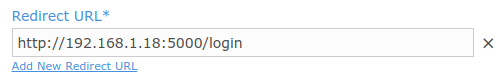
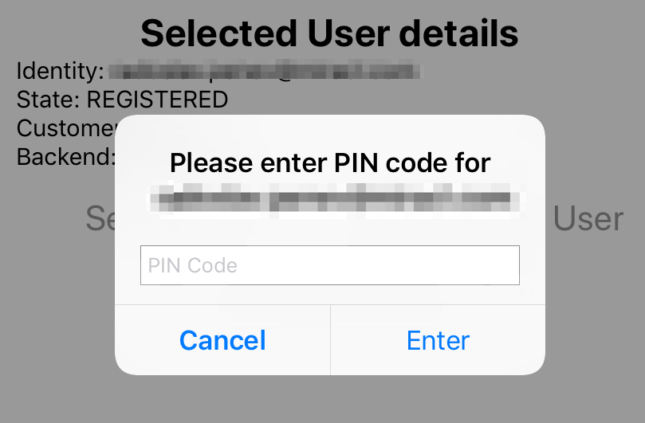

# Bootstrap Sample

* **category**: Samples
* **copyright**: 2019 MIRACL Technologies LTD
* **link**: https://github.com/miracl/sample-mobile-app-ios/tree/master/BootstrapSample

## Description

This sample demonstrates how to use the [MIRACL iOS SDK](https://github.com/miracl/mfa-client-sdk-ios) in order to transfer an identity from and to another device without the need of another customer verification. This is done by the so-called bootstrap codes and there are two cases depending on what the user wants to achieve.

The flow called `Bootstrap Code Generation` represents the case when there is already a registered identity on the device and the user wants to transfer it on another device:


The flow called `Bootstrap Code Registration` represents the case when the user creates a new identity on the device using an already generated bootstrap code from another device:


Keep in mind, that the bootstrap codes are currently available only for enterprise users. If you wish to make use of them, please contact us at support@miracl.com.

## Requirements

* iOS 12 or higher
* Cocoapods

## Setup

1. Checkout the sample project from : https://github.com/miracl/sample-mobile-app-ios.git
>> git clone https://github.com/miracl/sample-mobile-app-ios.git
2. [Run a demo web app](#create-a-demo-web-app-to-log-into)
3. [Configure the app with the issued credentials](#configure-the-app-with-the-issued-credentials)
4. Build the project:
    1. Navigate to the root folder of the checked-out project and then to BootstrapSample from the command line.
    2. Execute the following command in order to install the sample dependencies:
        >> pod install
    3. Open the created `BootstrapSample.xcworkspace` file in the current folder.

## Create a demo web app to log into

In order to be able to test the demo iOS app, you need to run a backend service as a relying party demo web app (RPA). The demo app should authenticate to the [MIRACL Trust authentication portal](https://trust.miracl.cloud/), called also MFA, using [OpenIDConnect](https://openid.net/connect/) protocol. More information could be found [here](http://docs.miracl.cloud/oidc-client-setup/). This means you need to login and create an application in the portal and use its credentials (`client id` and `client secret`) in the demo web app for the communication.

For the case of that sample, there is one more endpoint the RPA should implements as it is done at [this sample RPA project](https://github.com/miracl/maas-sdk-dotnet-core2#sample-endpoints):
* POST `/authzurl`
 This should return the following json formatted data on success as it is done [here](https://github.com/miracl/maas-sdk-dotnet-core2/blob/master/MiraclAuthenticationApp.Core2.0/Controllers/authtokenController.cs#L13):
```
{
    "authorizeURL": "<- The authorization url to the MFA ->"
}
```

Once you have run the demo web app you need to host it on a visible uri for the mobile app. Just be sure that the proper redirect uri (constructed as `demoAppUri/login`) is added as a redirect uri to the [authentication portal](https://trust.miracl.cloud/) application settings you're running this web app with:



## Configure the app with the issued credentials

Before building an iOS app, you need to configure it through the [`Config.m`](BootstrapSample/Configuration/Config.m) file:

```
+ (NSString*) companyId
{
    NSString *companyId = <# Replace with your company id #>;
    NSAssert(companyId, @"Company Id cannot be nil");
    return companyId;
}

+ (NSURL *)authzURL
{
    NSURLComponents *urlComponents = [[NSURLComponents alloc] init];
    urlComponents.scheme = <# Replace with your backend protocol scheme #>;
    urlComponents.host = <# Replace with your backend URL #>;
    urlComponents.port = @(<# Replace with your backend Port #>);
    urlComponents.path = @"/authzurl";

    NSURL *authzURL = urlComponents.URL;
    NSAssert(authzURL, @"authzURL cannot be nil");

    return authzURL;
}

+ (NSString *)mfaURL
{
    return @"https://api.mpin.io";
}
```

As the owner of the MFA web app, your `Company ID` is visible as a tooltip in the top right corner of your company dashboard in the MFA portal:


Note that `mfaURL` method should always returns https://api.mpin.io URL in order to authenticate against MIRACL Trust authentication portal.

## Bootstrap flows implementation by MFA iOS SDK

Application flows, described at the [beginning](#description) of the readme, are demonstrated in two tabs using `UITabBarController` where `Code Generation` tab implements `Bootstrap code generation` flow and `Code Registration` implements `Bootstrap Code registration` flow. Also there is a tab that lists user identities and gives an opportunity to delete an identity.

Since most of the Miracl iOS SDK methods are long-term operations, it is recommended to be called on background queue with `NSOperationQueue` or `Grand Central Dispatch`. You could see this pattern through the sample application.

### SDK Initialization

SDK initialization is done at [`AppDelegate.m`](BootstrapSample/AppDelegate.m) in `application: didFinishLaunchingWithOptions:` method by [`[MPinMFA initSDK]`](https://github.com/miracl/mfa-client-sdk-ios#void-initsdk), [`[MPinMFA SetClientId:]`](https://github.com/miracl/mfa-client-sdk-ios#void-setclientid-nsstring-clientid) and [`[MPinMFA SetBackend]`](https://github.com/miracl/mfa-client-sdk-ios#mpinstatus-setbackend-const-nsstring-url) methods.

```
[MPinMFA initSDK];
[MPinMFA SetClientId:[Config companyId]];
[MPinMFA SetBackend:[Config mfaURL]];
```

### Bootstrap Code Generation

All of the work is done at [`RegCodeRegistrationViewController`](BootstrapSample/View%20Controllers/RegCodeRegistrationViewController.m) which is presented when `Code Generation` tab is clicked.

When you run the demo there are two buttons on the screen:
* `Select User` - opens a list of already registered identities from which user can select;
* `Register New User` - uses the registration flow described [here](https://github.com/miracl/sample-mobile-app-ios/blob/master/MobileAppLoginSample/README.md#identity-registration) to create a new identity in order to have an identity to generate the bootstrap code with.

Choosing `Select User` and selecting an already registered identity from the list displays the following information:


You can see that there are three buttons - `Select User`, `Register New User` and `Generate Code`.
If you want to move the selected user identity to another device, press `Generate Code` button. Then [`[MPinMFA StartAuthenticationRegCode:]`](https://github.com/miracl/mfa-client-sdk-ios#mpinstatus-startauthenticationregcode-const-idiuser-user) method is called which kicks-off the authentication process:

```
MpinStatus *authStatus = [MPinMFA StartAuthenticationRegCode:self.selectedUser];
```

If the `MPinStatus` of the operation is `OK`, an alert view for the user PIN is presented:



The user needs to enter their PIN and the SDK method [`[MPinMFA FinishAuthenticationRegCode:pin:pin1:regCode]`](https://github.com/miracl/mfa-client-sdk-ios#mpinstatus-finishauthenticationregcode-const-idiuser-user-pin-nsstring-pin0-pin1-nsstring-pin1-regcode-regcode-regcode) is called to finalize the authentication process:

```
RegCode *registrationCode;
MpinStatus *finishAuthenticationStatus = [MPinMFA FinishAuthenticationRegCode:self.selectedUser
                                                                          pin:enteredPin
                                                                         pin1:nil
                                                                      regCode:&registrationCode];
```

Here, if registration for the bootstrap code is successful, an object reference is passed to `registrationCode` object which is displayed to the user, so they can enroll it in another device:

```
self.registrationCodeLabel.text = [NSString stringWithFormat:@"Bootstrap Code is: %@",registrationCode.otp];
```


### Bootstrap Code Registration

To register with a bootstrap code, the user needs to go to a device where they already have an identity created. You could use either another mobile app with an already registered identity, or the [backend](#create-a-demo-web-app-to-log-into) configured for this demo sample. Here we describe the second choice with running our [dotnet SDK](https://devdocs.trust.miracl.cloud/sdk-instructions/dotnet-core/) sample as a backend.

Go to the login identity screen of your backend and click on the settings icon of an already registered identity. There is an option called `Enroll a New Device`:


Keep in mind that if you don't see `Enroll a New Device` option, you are not an enterprise user. If you need this functionality, contact us at support@miracl.com.

`Enroll a New Device` requires authentication and asks you for your PIN. Then it displays the bootstrap code you need to use in your mobile device to transfer the identity to your phone.


Back to this demo sample, there is a `Register new User` button which needs to be clicked to initiate the identity transfer. The logic about this is in the [`RegCodeAuthenticationViewController`](BootstrapSample/View%20Controllers/RegCodeAuthenticationViewController.m) file.

First, an access code needs to be obtained by the `getAccessCodeWithCompletionHandler:` method where an HTTP POST request is made to the endpoint defined in [`[Config authzUrl]`](BootstrapSample/Configuration/Config.h).

Then, it needs to be verified if it doesn't already exist with [`[MPinMFA IsUserExisting: customerId:appId:]`](https://github.com/miracl/mfa-client-sdk-ios#boolean-isuserexisting-nsstring-identity-customerid-nsstring-customerid-appid-nsstring-appid) method. Finally, a user can be created with [`[MPinMFA MakeNewUser:deviceName:]`](https://github.com/miracl/mfa-client-sdk-ios#idiuser-makenewuser-const-nsstring-identity-devicename-const-nsstring-devname) method:

```
BOOL isExisiting = [MPinMFA IsUserExisting:mailTextFieldText customerId:[Config companyId] appId:@""];
if (isExisiting) {
    [self showMessage:@"User already registered"];
    return;
}

id<IUser> user = [MPinMFA MakeNewUser:mailTextFieldText
                            deviceName:@"Device name"];
```

When the user is created, registration can be started with a call to [`[MPinMFA StartRegistration: accessCode:regCode:pmi:]`](https://github.com/miracl/mfa-client-sdk-ios#mpinstatus-startregistration-const-idiuser-user-accesscode-nsstring-accesscode-regcode-nsstring-regcode-pmi-nsstring-pmi):
```
MpinStatus *registationStatus = [MPinMFA StartRegistration:user
                                                accessCode:accessCode
                                                   regCode:regCodeText
                                                        pmi:@""];
```

If `MPinStatus` value of the registration is OK, an alert view is prompted to the user to create a PIN code for their new identity on this device:


To finalize the registration [`[MPinMFA ConfirmRegistration:]`](https://github.com/miracl/mfa-client-sdk-ios#mpinstatus-confirmregistration-const-idiuser-user) and [`[MPinMFA FinishRegistration:pin0:pin1:]`](https://github.com/miracl/mfa-client-sdk-ios#mpinstatus-finishregistration-const-idiuser-user-pin0-nsstring-pin0-pin1-nsstring-pin1) methods are called:
```
MpinStatus *confirmationStatus = [MPinMFA ConfirmRegistration:user];
if (confirmationStatus.status == OK) {
    MpinStatus *finishRegistrationStatus = [MPinMFA FinishRegistration:user
                                                                  pin0:enteredPin
                                                                  pin1:nil];
}
```

and alert is presented to show the user they have already a registered identity on that device:


## See also

1. [MobileLoginSample](https://github.com/miracl/sample-mobile-app-ios/tree/master/MobileLoginSample)
2. [WebsiteLoginSample](https://github.com/miracl/sample-mobile-app-ios/tree/master/WebsiteLoginSample)
3. [DVSSample](https://github.com/miracl/sample-mobile-app-ios/tree/master/DVSSample)
