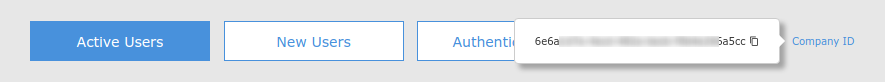
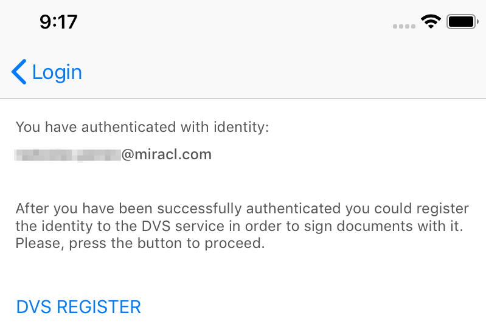
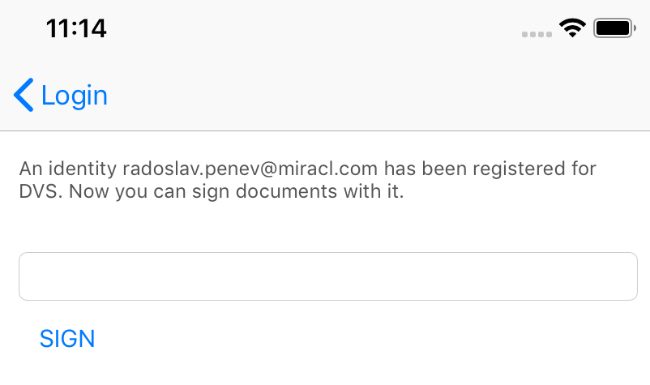
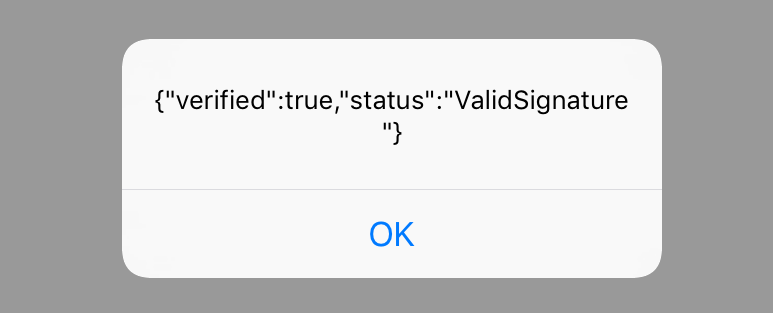

## DVSSample
* **category**: Samples
* **copyright**: 2019 MIRACL Technologies LTD
* **link**: https://github.com/miracl/sample-mobile-app-ios/tree/master/DVSSample/

## Description
This sample demonstrates how to use the [MIRACL iOS SDK](https://github.com/miracl/mfa-client-sdk-ios) in order to sign a transaction which can only be verified by a designated verifier using the [MIRACL MFA Platform](https://trust.miracl.cloud/) via an iOS device. These are the so-called **DVS Registration** and **DVS Signing** flows and here is the methods sequence user needs to follow in order to achieve it:


## Requirements
* MacOS Mojave or newer
* iOS 12 or newer

## Setup
1. Checkout the sample projects `https://github.com/miracl/sample-mobile-app-ios`
2. [Run a backend application](#create-a-demo-web-app-to-act-as-a-backend-service)
3. [Configure the app with the issued credentials](#configure-the-app-with-the-issued-credentials)
4. Open the `DVSSample/DVSSample.xcodeproj` and run the demo app from `Xcode`.

### Create a demo web app to act as a backend service
In order to be able to test the demo `DVS` sample app, you need to run a backend service as a relying party demo web app (RPA). You could use our .NET SDK as explained in the [.NET SDK Instructions](https://devdocs.trust.miracl.cloud/sdk-instructions/dotnet-core/dvs/) of our documentation.
The SDK authenticates to the [MIRACL Trust authentication portal](https://trust.miracl.cloud/), called also MFA, using [OpenIDConnect](https://openid.net/connect/) protocol. This means you need to login and create an application in it so you can take credentials (`client id` and `client secret`) for the communication. Note that the redirect URL set in this MFA web application needs to match your demo backend application, concatenated with `/login` by default.

Once you have run the demo web app you need to host it on a visible URI for the mobile app. These steps are documented in details in the
[dotnet SDK](https://devdocs.trust.miracl.cloud/sdk-instructions/dotnet-core/) which supports DVS functionality. Just reassure that the proper redirect URI (`demoAppUri/login`) is added as a redirect URI to the [authentication portal](https://trust.miracl.cloud/) application settings you're running the web app with:


### Configure the app with the issued credentials

Before starting the iOS application, you need to configure it through the [`Config.m`](DVSSample/model/Config.m) file:

```
+ (NSString *)companyId 
{
  return <# Replace with your company id #>;
}

+ (NSString *)accessCodeServiceBaseUrl 
{
  return  <# Replace with backend ip/domain hostname #> ;
}

+ (NSNumber *)accessCodeServicePort 
{
  return [NSNumber numberWithInteger: <# Replace with backend ip/domain port number #>];
}

+ (NSString *)httpScheme 
{
  return <# Replace with http scheme value #>;
}

+ (NSString *)authBackend 
{
  return @"https://api.mpin.io";
}
```

As the owner of the MFA web app, your `Company ID` is visible as a tooltip in the top right corner of your company dashboard in the MFA portal:



Note that `authBackend` method should always return https://api.mpin.io URL in order to authenticate against [MIRACL Trust authentication portal](https://trust.miracl.cloud/).

## **DVS Sample** implementation by MIRACL iOS SDK

Тhis sample uses **Registration** and **Mobile App Login** flows, which are explained in detail [here](https://github.com/miracl/sample-mobile-app-ios/tree/master/MobileAppLoginSample/README.md#mobile-app-login-flow-implementation-by-miracl-ios-sdk), in order to login into the mobile app itself. In this documentation, we focus only on the **DVS** implementation flows, so we assume that the user has already been issued with a `user ID` and an `access token`.

Also since most of the Miracl iOS SDK methods are long-term operations, it is recommended to be called on background queue with `NSOperationQueue` or `Grand Central Dispatch`. You could see this pattern through the sample application.

### SDK initialization
First step of SDK initialization is done at [`AppDelegate.m`](DVSSample/AppDelegate.m) in `application: didFinishLaunchingWithOptions:` method, where [`[MPinMFA initSDK]`](https://github.com/miracl/mfa-client-sdk-ios#void-initsdk) and [`[MPinMFA SetClientId:]`](https://github.com/miracl/mfa-client-sdk-ios#void-setclientid-nsstring-clientid) methods are called:
```
[MPinMFA initSDK];
[MPinMFA SetClientId: [Config companyId]];
```

## DVS Registration

The user needs to have a DVS identity (different than their authentication identity with the same user id) in order to sign documents, which is implemented at [`DVSRegistrationViewController.m`](DVSSample/viewcontroller/DvsRegistrationViewController.m). If a user has a DVS identity could be checked by [self.currentUser canSign](https://github.com/miracl/mfa-client-sdk-ios#idiuser-makenewuser-const-nsstring-identity-devicename-const-nsstring-devname) method. If it returns true, this identity could be used to [sign transactions](#dvs-signing). If it returns false, you need to create a signing identity for it. They need to authenticate first. That's why when `DVS REGISTER` button is clicked user first needs to enter their authentication identity PIN and after that [`[MPinMFA StartRegistrationDVS: pin0: pin1:]`](https://github.com/miracl/mfa-client-sdk-ios/tree/master#mpinstatus-startregistrationdvs-const-idiuser-user-pin0nsstring--pin0-pin1nsstring--pin1) method is called:



```
MpinStatus *status = [MPinMFA StartRegistrationDVS:self.appDelegate.currentUser pin0:pin pin1:nil];
```

If the authentication succeeded, the user is asked for their DVS Signing PIN. Then [`[MPinMFA FinishRegistrationDVS: pinDVS: nfc:]`](https://github.com/miracl/mfa-client-sdk-ios#mpinstatus-finishregistrationdvs-const-idiuser-user-pindvs-nsstring-pindvs-nfc-nsstring-nfc) method is called to complete their DVS Identity registration. Then the user could sign documents using the [`SignMessageViewController.m`](DVSSample/viewcontroller/SignMessageViewController.m) logic.
```
MpinStatus *status = [MPinMFA FinishRegistrationDVS:self.appDelegate.currentUser pinDVS:pin nfc:nil];
```

### DVS Signing

For simplicity signing in [`SignMessageViewController.m`](DVSSample/viewcontroller/SignMessageViewController.m) is done for a simple string, but could be done for different resources like files or pictures, that could be represented as a string. Keep in mind, that better usage of DVS is to sign the document hash, not the whole file instead.



The user needs to enter some text and click `SIGN` button. The DVS Identity signing PIN is required to sign the text.
Method `createDocumentHash` of [`AccessCodeServiceApi`](DVSSample/service/AccessCodeServiceApi.m) is executed to create a transaction of type [`DocumentDvsInfo`](DVSSample/model/DocumentDvsInfo.h) from the document text by making a `POST` request to the RPA backend service.

This transaction needs to be verified by [`[MPinMFA VerifyDocument: hash:]`](https://github.com/miracl/mfa-client-sdk-ios#bool-verifydocument-nsstring-strdoc-hash-nsdata-hash) method so the user is sure that the hash is correct.

```
BOOL verifiedDocument = [MPinMFA VerifyDocument:message hash:documentHash];
if (!verifiedDocument) {
    // ... 
}
```

To sign the transaction [`[MPinMFA Sign: documentHash: pin0: pin1: epochTime: result:]`](https://github.com/miracl/mfa-client-sdk-ios#mpinstatus-sign-idiuser-user-documenthash-nsdata-documenthash-pin0-nsstring-pin0-pin1-nsstring-pin1-epochtime-double-epochtime-result-bridgesignature-result) method is used:
```
id<IUser> user = self.appDelegate.currentUser;
double time = (double)info.timestamp;
BridgeSignature *bridgeSignature = nil;
MpinStatus *status = [MPinMFA Sign:user documentHash:[info.hashValue dataUsingEncoding:NSUTF8StringEncoding] pin0:pin pin1:nil epochTime:time result:&bridgeSignature];
```

If `status` result is `OK`, the user can verify the validity of the provided PIN with `verifySignature` method of [`AccessCodeServiceApi`](DVSSample/service/AccessCodeServiceApi.m). The result is displayed to the screen:



### See also:
1. [MobileLoginSample](https://github.com/miracl/sample-mobile-app-ios/tree/master/MobileLoginSample) 
2. [WebsiteLoginSample](https://github.com/miracl/sample-mobile-app-ios/tree/master/WebsiteLoginSample)
