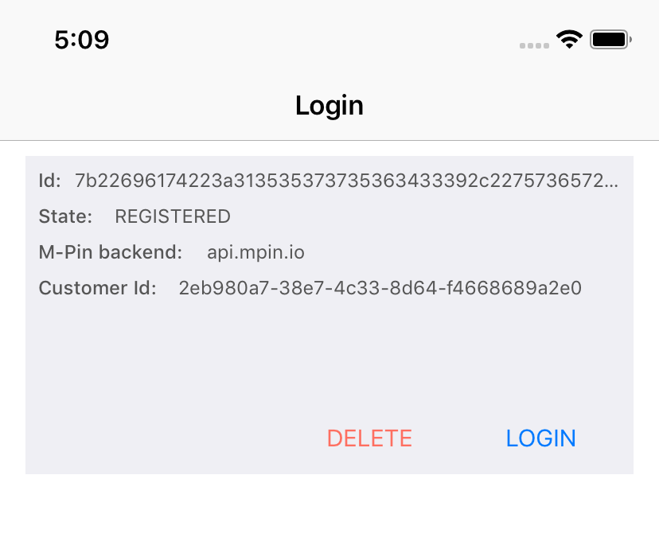
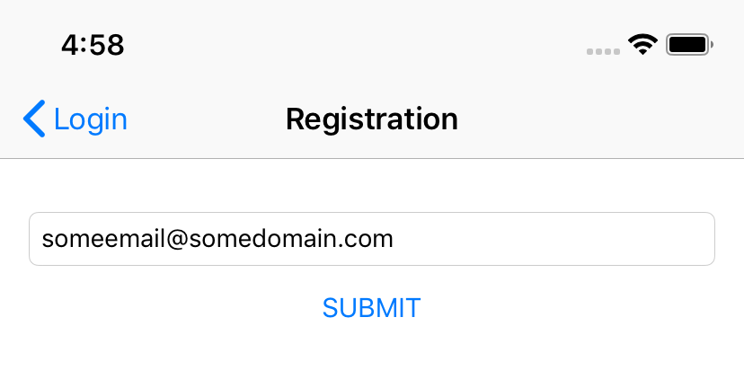
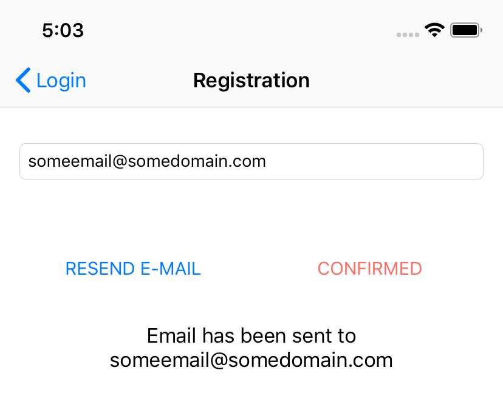
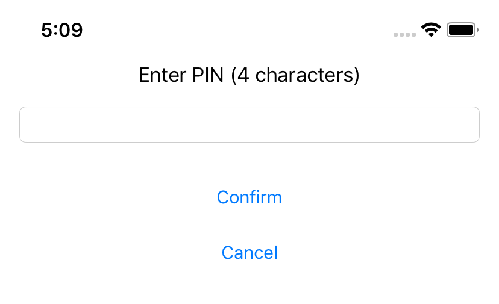

## DVSSample
* **category**: Samples
* **copyright**: 2019 MIRACL UK LTD
* **link**: https://github.com/miracl/sample-mobile-app-ios

## Description
This sample demonstrates how to use the [MIRACL iOS SDK](https://github.com/miracl/mfa-client-sdk-ios) in order create sign documents using [MIRACL MFA Platform](https://trust.miracl.cloud/) authentication via an iOS device. This is the so called `DVS` flow and here is the methods sequence you need to achieve it:

## Requirements
* MacOS Mojave
* XCode 10.1.2 or newer

## Setup
1. Clone `https://github.com/miracl/sample-mobile-app-ios` 
2. [Run a backend application](#create-a-demo-web-app-to-act-as-a-backend-service)
3. [Configure the app with the issued credentials](#configure-the-app-with-the-issued-credentials)
4. Open the `DVSSample/DVSSample.xcodeproj` and run the demo app from `XCode`.

### Create a demo web app to act as a backend service
In order to be able to test the demo iOS app you need to run a backend service as a demo web app. You could use our [.NET SDK](https://devdocs.trust.miracl.cloud/sdk-instructions/dotnet/dvs/). It is used to register and authenticate the user logging into your mobile app to the [MIRACL Trust authentication portal](https://trust.miracl.cloud/), called also `MFA`.
You will need a new app in the portal to get the authentication credentials (client id, client secret) with a properly set redirect url to the demo web app (it should be `demoAppUri/login`).

Once you have run the demo web app you need to host it on a visible uri for the mobile app. These steps are documented in details on the 
[dotnet SDK](https://devdocs.trust.miracl.cloud/sdk-instructions/dotnet/) which supports this functionality. Just reassure that the proper redirect uri (constructed as `demoAppUri/login`) is added as a redirect uri to the [authentication portal](https://trust.miracl.cloud/) application settings, you're running the web app with:

### Configure the app with the issued credentials

Before building an iOS app, you will need to obtain your `company id` as the owner of the MFA web app. This is visible as a tooltip in the top right corner of your company dashboard in the portal:

Once you have the company id, open the `DVSSample⁩/⁨DVSSample⁩/⁨model⁩/Config.m` and replace the placeholder text with the correct parameters as follows: 
The `companyId` method needs to return the company identifier. 
The `accessCodeServiceBaseUrl` method should return the url of your demo web app (configured using the web SDK, as per the [previous section](#create-a-demo-web-app-to-act-as-a-backend-service).

## Flow implementation

### AppDelegate
1. [`[MPinMFA initSDK]`](https://github.com/miracl/mfa-client-sdk-ios#void-initsdk) is called to initialize the `MFA SDK`. This is one time operation.
2. [`[MPinMFA SetClientId:]`](https://github.com/miracl/mfa-client-sdk-ios#void-setclientid-nsstring-clientid) to set the `company id`. This is one time operation.

### LoginViewController

1. [`/authzurl`](https://github.com/miracl/maas-sdk-dotnet-core2#sample-endpoints) endpoint is called to obtain access token.
2. [`[MPinMFA SetBackend:]`](https://github.com/miracl/mfa-client-sdk-ios#mpinstatus-setbackend-const-nsstring-url) is called to set the `MFA` url.
3. [`[MPinMFA listUsers]`](https://github.com/miracl/mfa-client-sdk-ios#nsmutablearray-listusers) is called to get the list of users. In the returned list all users which are not registered(`[user getState] == REGISTERED`) are deleted via [`[MPinMFA DeleteUser:]`](https://github.com/miracl/mfa-client-sdk-ios#void-deleteuser-const-idiuser-user)
4. From the remaining users a second filtering is applied where all users with `backend` property which are different from the one of the current sample app are ignored (`[[user getBackend] isEqualToString [Config authBackend]]`)
5. If there is such user satisfying the requirements listed in the previous steps then this user is selected and their details are displayed.

6. If there is no such user then the [RegistrationViewController](#registrationviewcontroller) is displayed
7. Selecting `Delete` will result in [`[MPinMFA DeleteUser:]`](https://github.com/miracl/mfa-client-sdk-ios#void-deleteuser-const-idiuser-user) SDK call.
8. Selecting `Login` will result in the following actions: 
8.1. [`/authzurl`](https://github.com/miracl/maas-sdk-dotnet-core2#sample-endpoints) endpoint is called to obtain an access token. 
8.2. User will be asked to [enter their `PIN` number](#enterpinviewcontroller) 
8.3. [`[MPinMFA StartAuthentication: accessCode:]`](https://github.com/miracl/mfa-client-sdk-ios#mpinstatus-startauthentication-const-idiuser-user-accesscode-nsstring-accesscode) is executed. 
8.4. [`[MPinMFA FinishAuthentication: pin: pin1: accessCode: authzCode:]`](https://github.com/miracl/mfa-client-sdk-ios#mpinstatus-finishauthentication-const-idiuser-user-pin-nsstring-pin-pin1-nsstring-pin1-accesscode-nsstring-accesscode-authzcode-nsstring-authzcode) is executed. If the user is `blocked` (`[user getState] == BLOCKED`) then the user is deleted with SDK call [`[MPinMFA DeleteUser:]`](https://github.com/miracl/mfa-client-sdk-ios#void-deleteuser-const-idiuser-user) 
8.5. [`/authtoken`](https://github.com/miracl/maas-sdk-dotnet-core2#sample-endpoints) endpoint is called to validate the login. 
8.6. If the user is authorized to sign documents [`SignMessageViewController`](#signmessageviewcontroller) is presented. Otherwise [`DvsRegistrationViewController`](#dvsregistrationviewcontroller) is presented. 

### SignMessageViewController

1. User enters a message which is going to be `signed`.
2. User is asked to [enter their `PIN` number](#enterpinviewcontroller)
3. `/CreateDocumentHash` endpoint is called which returns the following parameters - `timestamp`, `authToken` and `hash`
4. [`[MPinMFA Sign: documentHash: pin0: pin1: epochTime: result:]`](https://github.com/miracl/mfa-client-sdk-ios#mpinstatus-sign-idiuser-user-documenthash-nsdata-documenthash-pin0-nsstring-pin0-pin1-nsstring-pin1-epochtime-double-epochtime-authztoken-nsstring-authztoken-result-bridgesignature-result) is called to perform the signing.
5. `/VerifySignature` endpoint is called to verify the signature.

### DvsRegistrationViewController

1. User selects to `register` for `DVS` and is asked to [enter their `PIN` number](#enterpinviewcontroller)
2. [`[MPinMFA StartRegistrationDVS: pin0: pin1:]`](https://github.com/miracl/mfa-client-sdk-ios#mpinstatus-startregistrationdvs-const-idiuser-user-token-nsstring-token)
3. User is again asked to [enter their `PIN` number](#enterpinviewcontroller)
4. [`[MPinMFA FinishRegistrationDVS: pinDVS: nfc:]`](https://github.com/miracl/mfa-client-sdk-ios#mpinstatus-finishregistrationdvs-const-idiuser-user-pindvs-nsstring-pindvs-nfc-nsstring-nfc) is called to finalize `DVS registration`
5. [`SignMessageViewController`](#signmessageviewcontroller) is presented.

### RegistrationViewController

1. The user enters their email.

2. [`/authzurl`](https://github.com/miracl/maas-sdk-dotnet-core2#sample-endpoints) endpoint is called to obtain access token.
3. [`[MPinMFA MakeNewUser: deviceName:]`](https://github.com/miracl/mfa-client-sdk-ios#idiuser-makenewuser-const-nsstring-identity-devicename-const-nsstring-devname) is called to create a new user.
4. [`[MPinMFA StartRegistration: accessCode: pmi:]`](https://github.com/miracl/mfa-client-sdk-ios#mpinstatus-startregistration-const-idiuser-user) starts the registration process.

Then the user is presented with options to `Resend email` or `Confirm` the registration.

5. Pressing `Resend email` will result in SDK call to [`[MPinMFA RestartRegistration:]`](https://github.com/miracl/mfa-client-sdk-ios#mpinstatus-restartregistration-const-idiuser-user)
6. Pressing `Confirmed` will result in SDK call to [`[MPinMFA ConfirmRegistration:]`](https://github.com/miracl/mfa-client-sdk-ios#mpinstatus-confirmregistration-const-idiuser-user). Note that this operation will only be successfull if the user confirms their registration by openings the email link which should be sent to their email.
7. The user is asked to [enter their 4 digit `PIN` number](#enterpinviewcontroller).
8. A call to [`[MPinMFA FinishRegistration: pin0: pin1:]`](https://github.com/miracl/mfa-client-sdk-ios#mpinstatus-finishregistration-const-idiuser-user-pin0-nsstring-pin0-pin1-nsstring-pin1) to finalize the registration with the entered `PIN` number.

### EnterPinViewController

1. User enters their `PIN` number and confirms the action.

See also:
1. [InAppLoginSample](https://github.com/miracl/sample-mobile-app-ios/tree/master/InAppLoginSample) 
2. [WebsideLoginSample](https://github.com/miracl/sample-mobile-app-ios/tree/master/WebsiteLoginSample)
