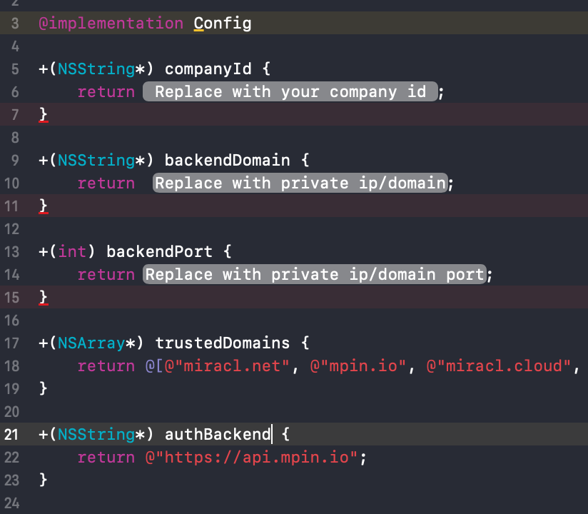

* **category**: Samples
* **copyright**: 2019 MIRACL UK LTD
* **link**: https://github.com/miracl/sample-mobile-app-ios

## Description

Sequence diagram of the `In app login` flow:


## Initialization

In order to download and build the projects you have to follow these steps:
1. Checkout the sample project from : https://github.com/miracl/sample-mobile-app-ios.git
>> git clone https://github.com/miracl/sample-mobile-app-ios.git
2. Open the root dir from the checked out project. Navigate to folder InAppLoginSampleApp
>> pod install

Then you can navigate to the desired project's directory and open its .xcworkspace file. Please continue with the instructions on how to issue the needed credentials and configure the app so it can build and run.


## Create a demo web app to act as a backend service

In order to be able to test the demo iOS app you need to run a backend service as a demo web app. You could use one of our web SDKs as explained in the [SDK Instructions](https://devdocs.trust.miracl.cloud/mobile-sdk-instructions/) section of this documentation. It is used to register and authenticate the user logging into your iOS app to the [MIRACL Trust authentication portal](https://trust.miracl.cloud/), called also MFA.
You will need a new app in the MIRACL Trust authentication portal to get the authentication credentials (client id, client secret) with a properly set redirect url to the demo web app (it should be `demoAppUri/login`).

Once you have run the demo web app you need to host it on a visible uri for the iOS app. These steps are documented in details on the 
[dotnet SDK](https://devdocs.trust.miracl.cloud/sdk-instructions/dotnet/) which supports this functionality. Just reassure that the proper redirect uri (constructed as `visibleUri/login`) is added as a redirect uri to the [authentication portal](https://trust.miracl.cloud/) application settings, you're running the web app with:


## Xcode Project Setup

Before building an iOS app, you will need to obtain your `company id` as the owner of the MFA web app. This is visible as a tooltip in the top right corner of your company dashboard in the portal:


While in XCode select the Config.m file and fill in the placeholders as follows:



```+(NSString*) companyId``` replace with your `company id`.

```+(NSString*) authBackend ``` with the uri of the hosted web app, visible to the iOS which you've run in the [previous section](https://github.com/miracl/sample-mobile-app-ios/tree/master/InAppLoginSample/#create-a-demo-web-app-to-act-as-a-backend-service).

```+(int) backendPort``` with the port of the hosted web app.

## XCode project file structure overview


The main storyboard view ```⁨InAppLoginSample⁩/⁨InAppLogin⁩/⁨InAppLogin⁩/⁨Base.lproj⁩/Main.storyboard``` shows the configuration of the different views and associated messages:


### Users array

Within `viewWillAppear` an array is set up to check if there are any registered users with the service:

```NSArray *arrUsers = [MPinMFA listUsers];```

If ```arrUsers.count``` returns `0`, then `setupAddId` will call the `AddId` view to begin the user registration process:


The demo app is only configured to deal with one registered user, so if `arrUsers.count` returns `> 1` users, the SDK `DeleteUser` method is called to delete all users. `setupAddId` will call the `AddId` view to begin the user registration process.

If the result is that there is one user found in the array (`_user = arrUsers[0];`) then the SDK `getState` method is called.

* If the user state is `INVALID`, the `DeleteUser` method is called and `setupAddId` will call `viewAddId` to begin the user registration process
* If the user state is `REGISTERED`, `setupRegistered` calls `viewRegistered` and makes use of the `getState`, `getBackend`, `getIdentity` and `GetCustomerId` methods to display the relevant info for the registered customer, who can login:


* If the user state is STARTED_REGISTRATION, `setupStartedRegistration` calls `viewStartedRegistration` and makes use of the `getState`, `getBackend`, `getIdentity` and `GetCustomerId` methods to display the relevant info for the customer, who can then complete the registration process:


### PinPadViewController.m


`PinPadView` is used to create the user's PIN which can be used later to login at any time.

After the PIN is entered and 'send' (`- (IBAction)onClickSendButton:(id)sender`) is clicked, a user status check is received. If it is `STARTED_REGISTRATION` the `FinishRegistration` SDK method is used:

`MpinStatus *mpinStatus = [MPinMFA FinishRegistration:_user pin:_txtPinPad.text];`

and the app navigates to the SuccessfulViewController view:

```
if ( mpinStatus.status == OK )  {
    UIViewController *vc = [[UIStoryboard storyboardWithName:@"Main" bundle:nil] instantiateViewControllerWithIdentifier:@"SuccessfulViewController"];
    [self.navigationController pushViewController:vc animated:YES];
}
```

If the user status is `REGISTERED` the `FinishAuthentication` SDK method is used:

```
MpinStatus *mpinStatus = [MPinMFA FinishAuthentication:_user
                                                   pin:_txtPinPad.text
                                            accessCode:_accessCode
                                             authzCode:&strAuthzCode];
```

If the `FinishAuthentication` method returns a status of OK the `checkAuthenticationStatus` method is called. This method makes use of the retreived `strAuthzCode` to obtain an authorization token from the `/authtoken` API endpoint from the backend service url. If the request is successful the user is logged in.
