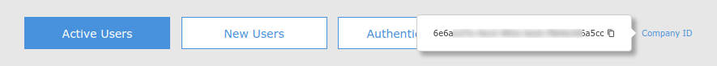

# InAppLoginSampleApp

Sequence diagram of the In app login flow:


In order to download and build the projects you have to do the following steps:
1. Checkout the sample project from : https://github.com/miracl/sample-mobile-app-ios.git
>> git clone https://github.com/miracl/sample-mobile-app-ios.git
2. Open the root dir from the checked out project. Navigate to folder InAppLoginSampleApp
>> pod install

After these steps you have to go to the desired project dir and open the .xcworkspace file. Please continue with the instructions on how to issue the needed credentials and configure the app so it can build and run.


### Create a demo web app to act as a backend service

Now that the project is imported, in order to enable you to test the demo iOS app, you should first of all create a demo MFA web app using one of our web SDKs, as explained in the [SDK Instructions](https://devdocs.trust.miracl.cloud/sdk-instructions/overview/) section of this documentation. The purpose of this is to have a running service which can authenticate all users who are registering with and logging into your iOS app (i.e. the web app will not be used for the purpose of in-browser login). Please note that, currently, only the [dotnet SDK](https://devdocs.trust.miracl.cloud/sdk-instructions/dotnet/) supports this functionality.

Once you have used the [authentication portal](https://trust.miracl.cloud/) to obtain a Client Id and Secret for your demo web app, you will need to configure the demo web app with these values, using the instructions provided on the web SDK page. It will then need to be hosted on an available url which means it is accessible by the iOS app. These steps are illustrated on the web SDK instructions page. A further note is that, if you are setting this up on a simple private network and using IIS Express to run the app which has been configured in Visual Studio, it will be necessary to make sure the firewall of the host machine allows incoming connections to the relevant port, and that the .vs/config/applicationhost.config file contains bindings which make it available:

```<bindings>
    <binding protocol="http" bindingInformation="*:5000:127.0.0.1" />
    <binding protocol="http" bindingInformation="*:5000:" />
</bindings>
```

The `<binding protocol="http" bindingInformation="*:5000:" />` line will allow binding to any IP. Using, for example, `<binding protocol="http" bindingInformation="*:5000:192.168.1.18" />` would allow binding to a specific private IP only.

Note that here `http://192.168.1.18 ` is only being used as an example of a private IP. `ipconfig` or `ifconfig` should be used to determine the private IP of the host machine.

Note that, for the web app settings in the authentication portal you will need to make sure there is a redirect url which has the private IP of the host machine as its base:


Once the demo web app is running and hosted it will be available for the iOS app to connect to as the backend service to which your iOS app can authenticate.

### Configure the XCode project

Before building an iOS app, you will need to obtain your company id as the owner of the MFA web app. This is visible as a tooltip in the top right corner of your company dashboard in the portal:


While in XCode select the Config.m file and fill in the placeholders as follows:

```+(NSString*) clientId``` replace with your company id.

```+(NSString*) backendDomain ``` fill in the placeholder with the private IP/domain which you filled in during the previous step(for example `192.168.1.18`)

```+(int) backendPort``` fill in the placeholder with the port for the private IP/domain

### XCode project file structure overview


The main storyboard view ```SampleApp/MPinApp/MPinApp/Base.lproj/Main.storyboard``` shows the configuration of the different views and associated messages:


### Users array

Within 'viewWillAppear' an array is set up to check if there are any registered users with the service:

```NSArray *arrUsers = [MPinMFA listUsers];```
If ```arrUsers.count``` returns `0`, then `setupAddId` will call the `AddId` view to begin the user registration process:


The demo app is only configured to deal with one registered user, so if `arrUsers.count` returns `> 1` user, the SDK `DeleteUser` method is called to delete all users. `setupAddId` will call the `AddId` view to begin the user registration process.

If the result is that there is one user found in the array (`_user = arrUsers[0];`) then the SDK getState method is called:

If the user state is INVALID, the `DeleteUser` method is called and `setupAddId` will call `viewAddId` to begin the user registration process.
If the user state is REGISTERED, `setupRegistered` calls `viewRegistered` and makes use of the `getState`, `getBackend`, `getIdentity` and `GetCustomerId` methods to display the relevant info for the registered customer, who can login:


If the user state is STARTED_REGISTRATION, `setupStartedRegistration` calls `viewStartedRegistration` and makes use of the getState, `getBackend`, `getIdentity` and `GetCustomerId` methods to display the relevant info for the customer, who can then complete the registration process:


### PinPadViewController.m


Once called the user can use this view to first of all create their PIN. The PIN can then be used to login at any time.

When the user enters their PIN and clicks 'send' (`- (IBAction)onClickSendButton:(id)sender`), a user status check is made. If the status is STARTED_REGISTRATION the FinishRegistration SDK method is used:

`MpinStatus *mpinStatus = [MPinMFA FinishRegistration:_user pin:_txtPinPad.text];`

and the app navigates to the SuccessfulViewController view:

```
if ( mpinStatus.status == OK )  {
    UIViewController *vc = [[UIStoryboard storyboardWithName:@"Main" bundle:nil] instantiateViewControllerWithIdentifier:@"SuccessfulViewController"];
    [self.navigationController pushViewController:vc animated:YES];
}
```

If the user status is REGISTERED the FinishAuthentication SDK method is used:

```
MpinStatus *mpinStatus = [MPinMFA FinishAuthentication:_user
                                                   pin:_txtPinPad.text
                                            accessCode:_accessCode
                                             authzCode:&strAuthzCode];
```

If the FinishAuthentication method returns a status of OK the checkAuthenticationStatus method is called. This method makes use of the retreived strAuthzCode to obtain an authorization token from the /authtoken API endpoint from the backend service url. If the request is successful the user is logged in.
