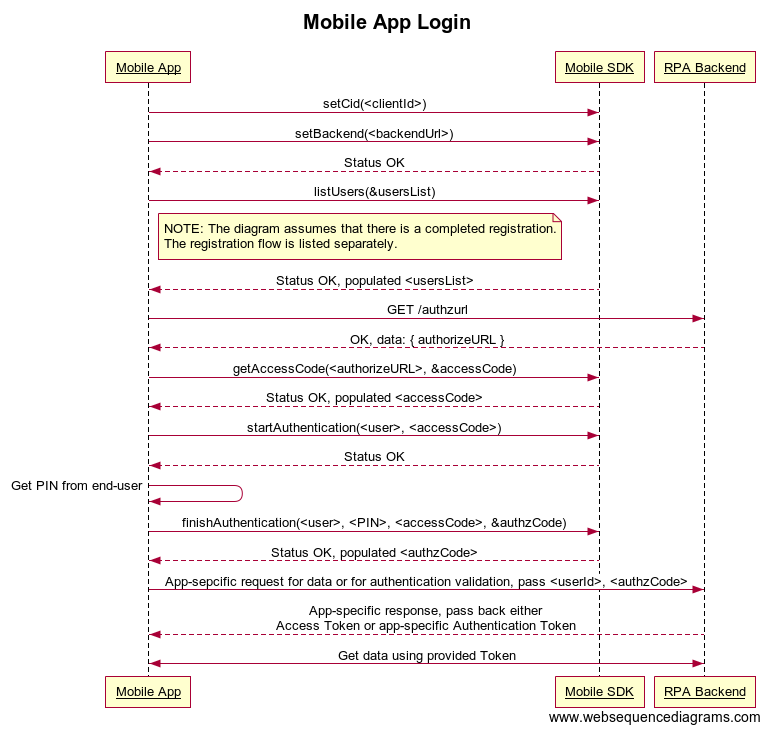
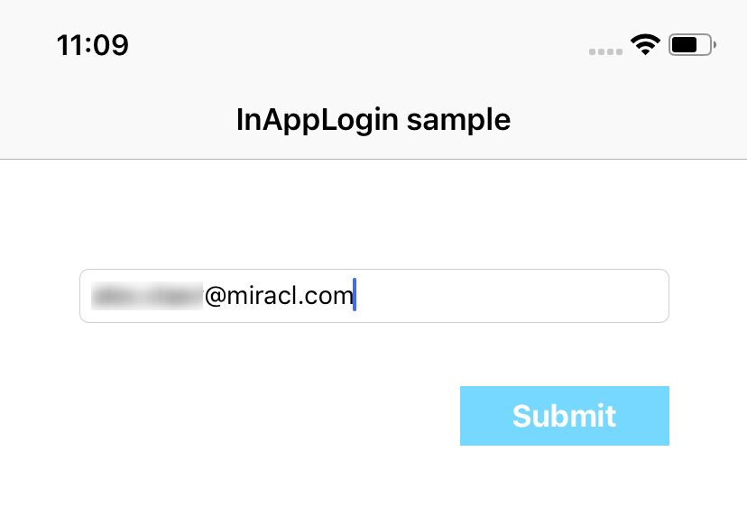
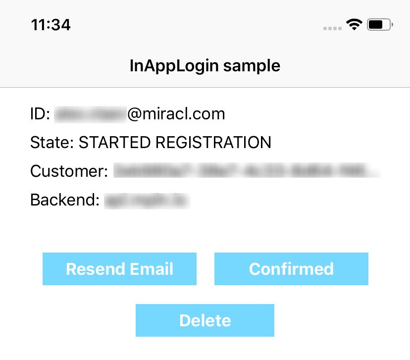
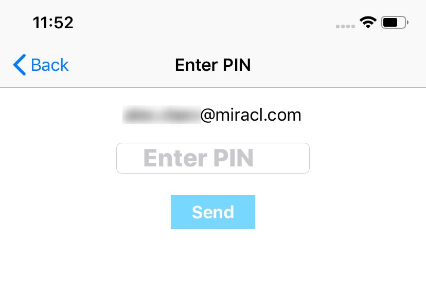
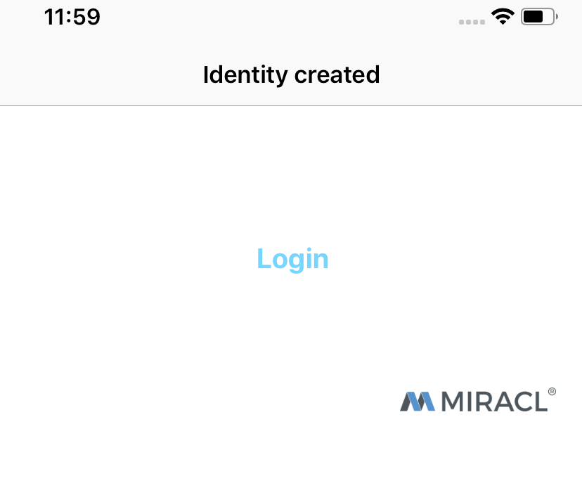
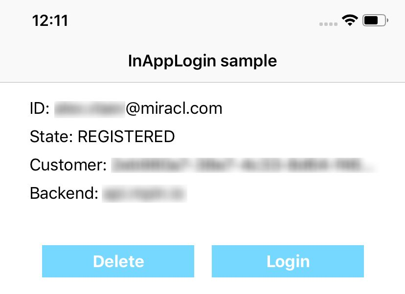
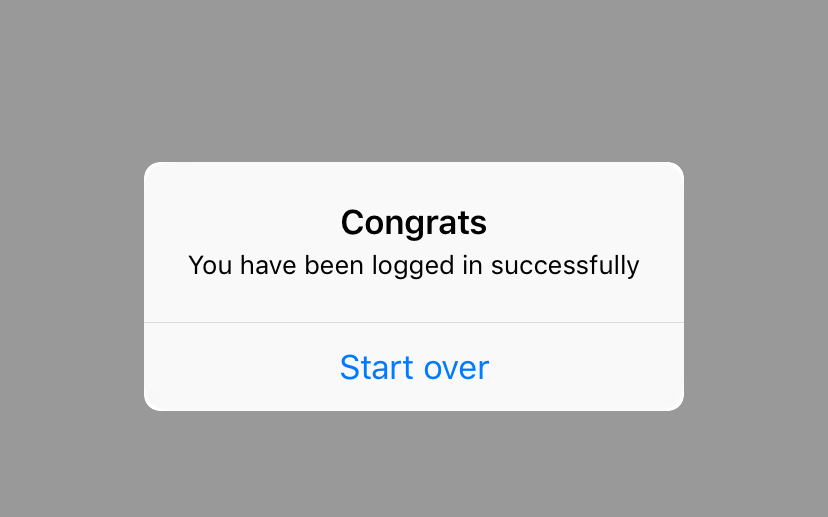

# Mobile App Login Sample

* **category**: Samples
* **copyright**: 2019 MIRACL UK LTD
* **link**: https://github.com/miracl/sample-mobile-app-ios/tree/master/MobileAppLoginSample

## Description

This sample demonstrates how to use the [MIRACL iOS SDK](https://github.com/miracl/mfa-client-sdk-ios) in order to login into the mobile app itself using [MIRACL MFA Platform](https://trust.miracl.cloud) authentication via an iOS device. This is the so called **Mobile App Login** and here is the methods sequence you need to achieve it:



## Requirements

* Xcode 10.0 or higher
* Cocoapods

## Setup

1. Checkout the sample project from : https://github.com/miracl/sample-mobile-app-ios.git
>> git clone https://github.com/miracl/sample-mobile-app-ios.git
2. From command line open the root dir from the checked out project. Navigate to folder MobileAppLoginSample:
>> cd MobileAppLoginSample
3. Execute the following command:
>> pod install
4. Open the .xcworkspace file which is located in the current directory.
5. [Run a backend application](#create-a-demo-web-app-to-act-as-a-backend-service)
6. [Configure the app with the issued credentials](#configure-the-app-with-the-issued-credentials)

## Create a demo web app to act as a backend service

In order to be able to test the demo iOS app you need to run a backend service as a relying party demo web app (RPA). You could use one of our web SDKs as explained in the [SDK Instructions](https://devdocs.trust.miracl.cloud/sdk-instructions/) of our documentation.
The SDK authenticates to the [MIRACL Trust authentication portal](https://trust.miracl.cloud/), called also MFA, using [OpenIDConnect](https://openid.net/connect/) protocol. This means you need to login and create an application in it so you can take credentials (`client id` and `client secret`) for the communication. Note that the redirect url set in this MFA web application needs to match your demo backend application, concatenated with `/login` by default.

Once you have run the demo web app you need to host it on a visible uri for the mobile app. These steps are documented in details in the
[dotnet SDK](https://devdocs.trust.miracl.cloud/sdk-instructions/dotnet/) which supports this functionality. Just reassure that the proper redirect uri (constructed as `demoAppUri/login`) is added as a redirect uri to the [authentication portal](https://trust.miracl.cloud/) application settings you're running the web app with:


## Configure the app with the issued credentials

Before building the iOS app, you need to configure it. In Xcode, open the [`Config.m`](MobileAppLoginSample/Config.m) file and fill in the placeholders as follows:

```
+(NSString*) companyId {
    return <# Replace with your company id #>;
}

+(NSString*) backendDomain {
    return <#Replace with backend ip/domain#>;
}

+(int) backendPort {
    return <#Replace with backend ip/domain port#>;
}

+(NSString*) httpScheme {
    return <# Replace with backend http scheme #>
}
```

As the owner of the MFA web app, your `Company ID` is visible as a tooltip in the top right corner of your company dashboard in the MFA portal:


Note that `authBackend` should always be https://api.mpin.io in order to authenticate against [MIRACL Trust authentication portal](https://trust.miracl.cloud/).

`backendDomain`, `backendPort` and `httpScheme` are parts from the url of your demo backend application [configured here](#create-a-demo-web-app-to-act-as-a-backend-service).

## Flow implementation

### RegisterViewController

Initial user registration process is managed in the [RegisterViewController.m](src/RegisterViewController.m). Initially when the screen is displayed the following methods are executed in the `viewDidLoad` method - 
first the SDK is [intialized](https://github.com/miracl/mfa-client-sdk-ios#void-initsdk) in [RegisterViewController.m](src/RegisterViewController.m) through the [`[MPinMFA initSDK]`](https://github.com/miracl/mfa-client-sdk-ios#void-initsdk) method. Then [`[MPinMFA SetClientId:]`](https://github.com/miracl/mfa-client-sdk-ios#void-setclientid-nsstring-clientid) is called. For improved security [`[MPinMFA AddTrustedDomain]`](https://github.com/miracl/mfa-client-sdk-ios#void-addtrusteddomain-nsstring--domain) is also called.

```
[MPinMFA initSDK];
[MPinMFA SetClientId:[Config companyId]];
NSArray *domains = [Config trustedDomains];
for(NSString *domain in domains) {
    [MPinMFA AddTrustedDomain: domain];
}
```

Then in `viewWillAppear` [`[MPinMFA SetBackend:]`](https://github.com/miracl/mfa-client-sdk-ios#mpinstatus-setbackend-const-nsstring-url) is called:

```
MpinStatus *mpinStatus = [MPinMFA SetBackend: [Config authBackend]];
```

If `mpinStatus.status` has value `OK` the next step is to obtain `acess code`. This is done in the `getAccessCode` method where an `HTTP POST` request is made to the endpoint defined in `[Config authzUrl]`. This request returns `JSON` as a response from where we get the `authorizeURL`

```
jsonObject[@"authorizeURL"]
```

This `authorizeURL` is used to obtain the `access code`:

```
MpinStatus *mpinStatus  = [MPinMFA GetAccessCode:jsonObject[@"authorizeURL"] accessCode:&strAccessCode];
```

If `mpinStatus.status` has value `OK` this means that the `access code` has been successfully obtained.
To start the registration the user is first asked to enter their email: 



Once the user fills in their email and presses `Submit` the following code is executed:

```
self.user = [MPinMFA MakeNewUser:strUserName deviceName:@"SampleDevName"];
MpinStatus *mpinStatus = [MPinMFA StartRegistration:self.user accessCode:self.accessCode pmi:@"PMI-TEST"];
```

[`[MPinMFA MakeNewUser: deviceName:]`](https://github.com/miracl/mfa-client-sdk-ios#idiuser-makenewuser-const-nsstring-identity-devicename-const-nsstring-devname) creates a new user and [`[[MPinMFA StartRegistration: accessCode: pmi:]`](https://github.com/miracl/mfa-client-sdk-ios#mpinstatus-startregistration-const-idiuser-user-accesscode-nsstring-accesscode-pmi-nsstring-pmi) starts the registration process for that new user.
If `mpinStatus.status` has a value `OK` this means that the registration was started sucessfully. The user is then presented with a UI to confirm the registration:




Once the user presses the `Confirmed` button this trigger an sdk call to [`[MPinMFA ConfirmRegistration:]`](https://github.com/miracl/mfa-client-sdk-ios#mpinstatus-confirmregistration-const-idiuser-user).

```
 MpinStatus *mpinStatus = [MPinMFA ConfirmRegistration:self.user];
```

If `mpinStatus.status` has value `OK` then the operation is successful and the user is presented with a [`PinPadViewController`](src/PinPadViewController.m) to create their PIN(see more about `PinPadViewController` [here](#PinPadViewController)):



When the user enter their `PIN` number and presses `Send`, the `onClickSendButton` method is called where [`[MPinMFA FinishRegistration: pin0: pin1:]`](https://github.com/miracl/mfa-client-sdk-ios#mpinstatus-finishregistration-const-idiuser-user-pin0-nsstring-pin0-pin1-nsstring-pin1) is called:

```
MpinStatus *mpinStatus = [MPinMFA FinishRegistration:self.user pin0:strPIN pin1:nil];
```

If `mpinStatus.status` has value `OK` then the registration is finished and the user is presented with [`SuccessfulViewController`](src/SuccessfulViewController.m):



Pressing the `Login` button will send the user to the previous screen where they need to press the back button again to return the [RegisterViewController.m](src/RegisterViewController.m). Now `RegisterViewController` will find the registered user within the `viewWillAppear` method and display the information for that user:

```
_user = arrUsers[0];
switch ([_user getState])
{
	...
    case REGISTERED:
        [self setupRegistered];
 	...      
```
The user will see the following UI:



If the user decides to press the `Delete` button this will result in a call to [`[MPinMFA DeleteUser:]`](https://github.com/miracl/mfa-client-sdk-ios#void-deleteuser-const-idiuser-user) and the flow will need to start over as there will be no registered user to log in with.

If the user presses the `Login` button then the authentication process will begin for that user:

```
- ( IBAction) login:(id)sender
{
    [self startAuthentication];
}
``` 

Within the `startAuthentication` method first [`[[MPinMFA StartAuthentication: accessCode:]]`](https://github.com/miracl/mfa-client-sdk-ios#mpinstatus-startauthentication-const-idiuser-user-accesscode-nsstring-accesscode) is called:

```
MpinStatus *mpinStatus = [MPinMFA StartAuthentication:self.user accessCode:self.accessCode];
```

If `mpinStatus.status` has value `OK` the user will be presented with [`PinPadViewController`](src/PinPadViewController.m) to enter their `PIN` number. After entering the `PIN` number and pressing `Send` the `- (IBAction)onClickSendButton:(id)sender` of `PinPadViewController.m` is called which will now detect that a PIN is being entered for a registered user which will result in a call to [`[[MPinMFA FinishAuthentication: pin: pin1:]`](https://github.com/miracl/mfa-client-sdk-ios#mpinstatus-finishauthentication-const-idiuser-user-pin-nsstring-pin-pin1-nsstring-pin1-accesscode-nsstring-accesscode-authzcode-nsstring-authzcode)

```
...
else if([_user getState] == REGISTERED) {
...
MpinStatus *mpinStatus = [MPinMFA FinishAuthentication:self.user pin:strPIN pin1:nil accessCode:self.accessCode authzCode:&strAuthzCode];
}
```

If `mpinStatus.status` has value `OK` the `strAuthzCode` will contain a non empty auth code. The next step is to use that `strAuthzCode` to make a `HTTP POST` request to the url defined in `[Config authCheckUrl]`. If the `HTTP Status` code in the response is `200` this means that the login is sucessful which also marks the end of the flow and the user will be presented with a popup message to indicate that:



Pressing `Start over` will send the user back so they can log in again with the same user.

It is worth mentioning that [RegisterViewController.m](src/RegisterViewController.m) executes multiple roles within the demo. It shows the registration UI if there are no users. It will also show the appropriate UI in order to confirm a started registration. And finally it will show the information for an existing registered user allowing login for that user.


### PinPadViewController

The purpose of this view controller is to collect `PIN` number from the user and handle it.
First within the `viewWillAppear` method the current user is loaded with a call to [`[MPinMFA listUsers]`](https://github.com/miracl/mfa-client-sdk-ios#nsmutablearray-listusers)

```
_user = [MPinMFA listUsers][0];
```

[`PinPadViewController`](src/PinPadViewController.m) has different behavior when handling the entered `PIN` depending on the user state `[_user getState]`.
Once the user enters a `PIN` number `onClickSendButton` is called where depending on the value of `[_user getState]` different operations are performed. If the state is `STARTED_REGISTRATION` the app will try to finish the registration with a call to [`[MPinMFA FinishRegistration: pin0: pin1:]`](https://github.com/miracl/mfa-client-sdk-ios#mpinstatus-finishregistration-const-idiuser-user-pin0-nsstring-pin0-pin1-nsstring-pin1). If the state is `REGISTERED`
the app will try to finish authentication with a call to [`[[MPinMFA FinishAuthentication: pin: pin1:]`](https://github.com/miracl/mfa-client-sdk-ios#mpinstatus-finishauthentication-const-idiuser-user-pin-nsstring-pin-pin1-nsstring-pin1-accesscode-nsstring-accesscode-authzcode-nsstring-authzcode). If the state is `BLOCKED` an error message will be displayed.

## See also

* [DvsSample](https://github.com/miracl/sample-mobile-app-ios/tree/master/DVSSample)
* [WebsiteLoginSample](https://github.com/miracl/sample-mobile-app-ios/tree/master/WebsiteLoginSample)