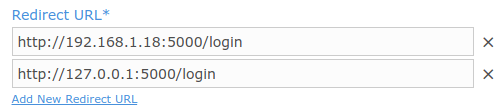

* **category**: Samples
* **copyright**: 2019 MIRACL UK LTD
* **link**: https://github.com/miracl/sample-mobile-app-ios

## Description

Sequence diagram of the `Website login` flow:


## Initialization

In order to download and build the projects you have to do the following steps:
1. Checkout the sample project from : https://github.com/miracl/sample-mobile-app-ios.git
>> git clone https://github.com/miracl/sample-mobile-app-ios.git
2. Open the root dir from the checked out project. Navigate to folder WebsiteLoginSample and execute
>> pod install

After this steps you have to go to the desired project dir and open the .xcworkspace file. 

## Create a demo web app to log into
In order to be able to test the demo iOS app you need to run a backend service as a demo web app. You could use one of our web SDKs as explained in the [SDK Instructions](https://devdocs.trust.miracl.cloud/mobile-sdk-instructions/) section of this documentation. It is used to register and authenticate the user logging into your iOS app to the [MIRACL Trust authentication portal](https://trust.miracl.cloud/), called also a platform.

This involves the following:

* You will need a new app in the [MIRACL Trust authentication portal](https://trust.miracl.cloud/) to get the authentication credentials (client id, client secret) with a properly set redirect url to the demo web app (this is detailed in the instructions for each web SDK).
* Run a demo app using one of our web SDKs ([flask](https://devdocs.trust.miracl.cloud/sdk-instructions/python/), [django](https://devdocs.trust.miracl.cloud/sdk-instructions/django/), [nodejs](https://devdocs.trust.miracl.cloud/sdk-instructions/nodejs/), [ruby](https://devdocs.trust.miracl.cloud/sdk-instructions/ruby/), [php](https://devdocs.trust.miracl.cloud/sdk-instructions/phpsdk/), [go](https://devdocs.trust.miracl.cloud/sdk-instructions/go/), [java](https://devdocs.trust.miracl.cloud/sdk-instructions/java/), [dotnet](https://devdocs.trust.miracl.cloud/sdk-instructions/dotnet/)).
In your web browser, visit the configured url for the demo web app. It is important the web app to be accessible from the iOS app, so make sure that the web app is properly hosted. It is also important to set the proper redirect url in the platform app you're using as `webAppUrl/login.`



Before building an iOS app, you will need to obtain your company id as the owner of the MFA web app. This is visible as a tooltip in the top right corner of your company dashboard in the portal:


## Xcode Project Setup


The main storyboard view `WebsiteLoginSample⁩/⁨WebsiteLogin⁩/⁨WebsiteLogin⁩/⁨Base.lproj⁩/Main.storyboard` shows the configuration of the different views and associated messages:


### Config.m

To build the project you will need to replace the placeholders with the appropriate parameters:


```+(NSString*) companyId``` replace with your `company id`.

`+(NSArray*) trustedDomains` - fill in with the uri of the hosted web app, visible to the iOS which you've run in the [previous section](https://github.com/miracl/sample-mobile-app-ios/tree/master/WebsiteLoginSample/#create-a-demo-web-app-to-log-into).

Then click on the web app Login button and you can scan the resulting QR code with the iOS app to login and authenticate to the platform.

### QRViewController.m

The `captureOutput` method is called to extract the raw information from the QR code image and parse it with:

`[self parseResponse:[metadataObj stringValue]];`

`parseResponse` extracts the information, including the base url and access code from the QR code. The extracted information is obtained as a JSON data structure and passed to the `serviceReaded` method for further processing.

Then `setBackend` is called to set the backend url to authenticate to.

The key section in it is:

```
MpinStatus *mpinStatus = [MPinMFA SetBackend:config[@"url"]
dispatch_async(dispatch_get_main_queue(), ^ (void) {
    if ( mpinStatus.status == OK )  {
        dispatch_after(dispatch_time(DISPATCH_TIME_NOW, 1 * NSEC_PER_SEC), dispatch_get_main_queue(), ^{
            [self onSetBackendCompleted:accessCode];
        });
    }

```

This sets the backend using the base url retrieved from the QR code, and then calls `onSetBackendCompleted`.

Then if no users are registered then the app navigates to the User Registration page (RegisterViewController.m). If there is a user it checks the user's state:

* If the user is in the `STARTED_REGISTRATION` state, the app navigates to the finish registration stage. This is also handled by the RegisterViewController.m page.
* If the user is in the `REGISTERED` state, the app navigates to the Authentication page (PinPadViewController.m). From here the user can authenticate and login to the service.
* If the user is in any other User state, an Error message is shown.


### RegisterViewController.m


Once the user has entered their email address, the Submit button starts the registration process. `onClickAddmButton` uses `getIUserById` to check if the email is already registered with the backend. If not and a valid new email address is entered, then `MakeNewUser` begins the registration process.

A message "Your Identity has been created!" is displayed on the screen and the user needs to confirm their identity from the received mail by clicking on the confirmation link. Then, back in the iOS app screen, click the `Confirmed` button which is controlled by `onClickConfirmButton`. Here the `ConfirmRegistration` method is used to make a status check if the confirmation link has been followed in the user's email. Then a `client key` is retrieved for the user and the PinPadViewController.m view is instantiated to enable the user to create their PIN.

If there is a problem (i.e. email does not arrive) the user has the option to press the Re-send email button, which is controlled by `onClickResendButton`. This invalidates the registration with `DeleteUser` and starts it again with `MakeNewUser`.

### PinPadViewController.m

This controller uses `listUsers` to create an array and check to see if any users are already registered with the backend. If so, it displays the PIN pad for the registered user. Note that the demo app is made to allow only one identity per backend.


Once a PIN is entered, the user taps the Send button. If the user state is `STARTED_REGISTRATION`, `onClickSendButton` call the `FinishRegistration` method to finalizes the user registration process. It extracts the M-Pin Token from the `client key` for the provided PIN (secret), and then stores the token in the secure storage. On successful completion, the user state will be set to `REGISTERED` and the method will return status OK.

If the user's state is `REGISTERED` they are able to authenticate and login using their PIN. If the PIN is correct the user is successfully authenticated and the app navigates the user to the Login Successful page:


