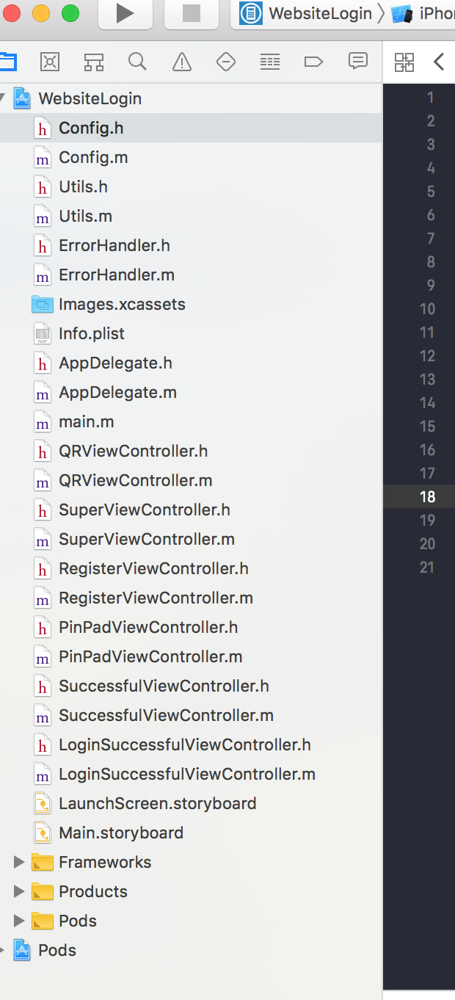
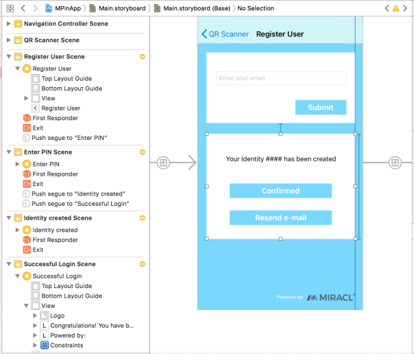
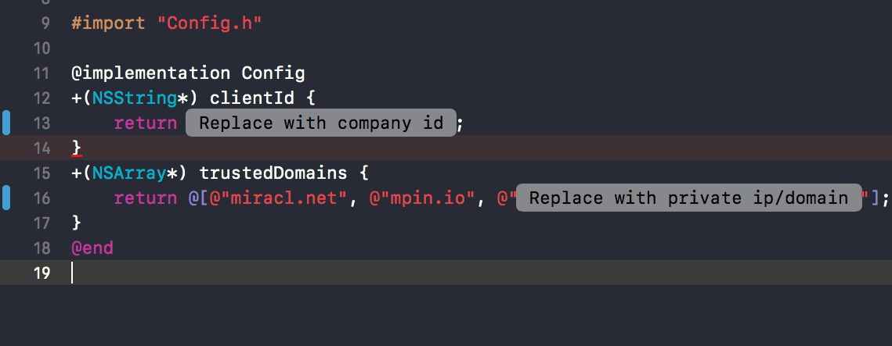
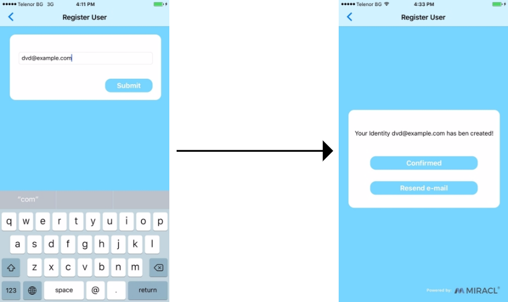
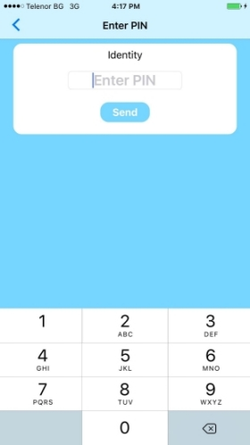

# WebsiteLoginSample

Sequence diagram of the Website login flow:


In order to download and build the projects you have to do the following steps:
1. Checkout the sample project from : https://github.com/miracl/sample-mobile-app-ios.git
>> git clone https://github.com/miracl/sample-mobile-app-ios.git
2. Open the root dir from the checked out project. Navigate to folder WebsiteLoginSample and execute
>> pod install

After this steps you have to go to the desired project dir and open the .xcworkspace file. 

### Create a demo web app to log into
Now that the project is imported, in order to enable you to test the demo iOS app, you should first of all create a demo MFA web app using one of our web SDKs, as explained in the [SDK Instructions](https://devdocs.trust.miracl.cloud/mobile-sdk-instructions/) section of this documentation.

This involves the following:

Register a new app in the MIRACL Trust authentication portal (this is detailed in the instructions for each web SDK mentioned in step 2)
Run a demo app using one of our web SDKs ([flask](https://devdocs.trust.miracl.cloud/sdk-instructions/python/), [django](https://devdocs.trust.miracl.cloud/sdk-instructions/django/), [nodejs](https://devdocs.trust.miracl.cloud/sdk-instructions/nodejs/), [ruby](https://devdocs.trust.miracl.cloud/sdk-instructions/ruby/), [php](https://devdocs.trust.miracl.cloud/sdk-instructions/phpsdk/), [go](https://devdocs.trust.miracl.cloud/sdk-instructions/go/), [java](https://devdocs.trust.miracl.cloud/sdk-instructions/java/), [dotnet](https://devdocs.trust.miracl.cloud/sdk-instructions/dotnet/))
In your web browser, visit the configured url for the demo web app configured in step 2 (as per the instructions, this can be a simple localhost url such as `http://127.0.0.1:5000`) and click on the login button: php login
You will then be able to scan the resulting QR code and login with an iOS app built as per the instructions to follow in this guide


Before building an iOS app, you will need to obtain your company id as the owner of the MFA web app. This is visible as a tooltip in the top right corner of your company dashboard in the portal:


### iOS Demo App Overview



The main storyboard view `SampleApp/MPinApp/MPinApp/Base.lproj/Main.storyboard` shows the configuration of the different views and associated messages:



### Config.m

To build the project you will need to replace the placeholders with the appropriate parameters:



`+(NSString*) clientId` - fill in with company id which you obtained in an earlier step

`+(NSArray*) trustedDomains` - fill in with your private ip/domain


### QRViewController.m

The captureOutput method is called and the raw information extracted from the QR code can be parsed:

`[self parseResponse:[metadataObj stringValue]];`

parseResponse extracts the information, including the base url and access code from the QR code. The extracted information is obtained as a JSON data structure and passed to the serviceReaded method for further processing.

```
- ( void ) parseResponse:( NSString * ) strResponse
{
    NSRange range = [strResponse rangeOfString:@"#"];
    if ( range.location != NSNotFound )
    {
        NSString *strBaseURL = [strResponse substringToIndex:range.location];
        NSString *strCode   = [strResponse substringFromIndex:range.location + 1];
        dispatch_async(dispatch_get_global_queue(DISPATCH_QUEUE_PRIORITY_DEFAULT, 0), ^ {
            NSHTTPURLResponse *response;
            NSError *error;
            NSURL *theUrl = [NSURL URLWithString:[NSString stringWithFormat:@"%@/service",strBaseURL]];
            NSMutableURLRequest *request = [NSMutableURLRequest requestWithURL:theUrl cachePolicy:NSURLRequestReloadIgnoringCacheData timeoutInterval:10];
            [request setTimeoutInterval:10];
            request.HTTPMethod = @"GET";

            NSAssert(kStrCID != nil, @"kStrCID should contain your CID");
            [request setValue:kStrCID forHTTPHeaderField:@"X-MIRACL-CID"];

            NSData *jsonData = [NSURLConnection sendSynchronousRequest:request returningResponse:&response error:&error];
            if(error != nil)    {
                dispatch_async(dispatch_get_main_queue(), ^ (void) {
                    [[ErrorHandler sharedManager] hideMessage];
                    UIAlertView *alertView = [[UIAlertView alloc] initWithTitle:@"Error"
                                                                        message:error.description
                                                                       delegate:self
                                                              cancelButtonTitle:@"Ok"
                                                              otherButtonTitles:nil];
                    [alertView show];
                });
            }
            else if (response.statusCode == 412)
            {
                dispatch_async(dispatch_get_main_queue(), ^ (void) {
                    [[ErrorHandler sharedManager] hideMessage];
                    UIAlertView *alertView = [[UIAlertView alloc] initWithTitle:@"Error"
                                                                        message:@"Deprecated version"
                                                                       delegate:self
                                                              cancelButtonTitle:@"Ok"
                                                              otherButtonTitles:nil];
                    [alertView show];
                });
            }
            else if(response.statusCode == 406) {
                dispatch_async(dispatch_get_main_queue(), ^ (void) {
                    [[ErrorHandler sharedManager] hideMessage];
                    UIAlertView *alertView = [[UIAlertView alloc] initWithTitle:@"Error"
                                                                        message:@"You cannot use this app to login to this service."
                                                                       delegate:self
                                                              cancelButtonTitle:@"Ok"
                                                              otherButtonTitles:nil];
                    [alertView show];
                });
            }
            else
            {
                [self serviceReaded:jsonData accessCode:strCode];
            }
        });
    }
    else
    {
        dispatch_async(dispatch_get_main_queue(), ^ (void) {
            [[ErrorHandler sharedManager] hideMessage];
            UIAlertView *alertView = [[UIAlertView alloc] initWithTitle:@"Error" message:@"Invalid QR!" delegate:self cancelButtonTitle:@"Ok" otherButtonTitles:nil];
            [alertView show];
            dispatch_after(dispatch_time(DISPATCH_TIME_NOW, 1.f * NSEC_PER_SEC), dispatch_get_main_queue(), ^ (void){
                [self performSelectorOnMainThread:@selector( startReading ) withObject:nil waitUntilDone:NO];
            });
        });
    }

}
```

`[self serviceReaded:jsonData accessCode:strCode];` passes the json data and access code to the serviceReaded method, which uses setBackend to set the backend url:

```
- ( void ) serviceReaded: (NSData *)service accessCode:(NSString *) accessCode
{
    self.accessCode = accessCode;
    if ( service != nil )
    {
        NSError *error;
        NSDictionary *config = [NSJSONSerialization JSONObjectWithData:service options:kNilOptions error:&error];
        if (error != nil)
        {
            dispatch_async(dispatch_get_main_queue(), ^ (void) {
                [[ErrorHandler sharedManager] hideMessage];
                UIAlertView *alertView = [[UIAlertView alloc] initWithTitle:@"Error"
                                                                    message:error.description
                                                                   delegate:self
                                                          cancelButtonTitle:@"Ok"
                                                          otherButtonTitles:nil];
                [alertView show];

            });
        }
        else if(config[@"url"] == nil || config[@"rps_prefix"] == nil || config[@"type"] == nil || config[@"name"] == nil || config[@"logo_url"] == nil)
        {
            dispatch_async(dispatch_get_main_queue(), ^ (void) {
                [[ErrorHandler sharedManager] hideMessage];
                UIAlertView *alertView = [[UIAlertView alloc] initWithTitle:@"Error"
                                                                    message:@"Invalid configuration"
                                                                   delegate:self
                                                          cancelButtonTitle:@"Ok"
                                                          otherButtonTitles:nil];
                [alertView show];
            });
        }   else    {
            MpinStatus *mpinStatus = [MPinMFA SetBackend:config[@"url"] rpsPrefix:config[@"rps_prefix"]];
            dispatch_async(dispatch_get_main_queue(), ^ (void) {
                if ( mpinStatus.status == OK )  {
                    dispatch_after(dispatch_time(DISPATCH_TIME_NOW, 1 * NSEC_PER_SEC), dispatch_get_main_queue(), ^{
                        [self onSetBackendCompleted:accessCode];
                    });
                }
                else
                {
                    [[ErrorHandler sharedManager] updateMessage:[NSString stringWithFormat:@"Set BackEnd Error: %ld", (long)mpinStatus.status] addActivityIndicator:NO hideAfter:0];
                    dispatch_after(dispatch_time(DISPATCH_TIME_NOW, 3 * NSEC_PER_SEC), dispatch_get_main_queue(), ^ (void){
                        [[ErrorHandler sharedManager] hideMessage];
                        [self  startReading];
                    });

                }
            });
        }
    }   else    {
        dispatch_async(dispatch_get_main_queue(), ^ (void) {
            [[ErrorHandler sharedManager] hideMessage];
            UIAlertView *alertView = [[UIAlertView alloc] initWithTitle:@"Error"
                                                                message:@"Service unavailable!"
                                                               delegate:self
                                                      cancelButtonTitle:@"Ok"
                                                      otherButtonTitles:nil];
            [alertView show];
        });
    }
}
```

The key section above is:


```
MpinStatus *mpinStatus = [MPinMFA SetBackend:config[@"url"] rpsPrefix:config[@"rps_prefix"]];
dispatch_async(dispatch_get_main_queue(), ^ (void) {
    if ( mpinStatus.status == OK )  {
        dispatch_after(dispatch_time(DISPATCH_TIME_NOW, 1 * NSEC_PER_SEC), dispatch_get_main_queue(), ^{
            [self onSetBackendCompleted:accessCode];
        });
    }

```

This sets the backend using the base url retrieved from the QR code, and then calls onSetBackendCompleted.

onSetBackendCompleted then checks for any users already registered with the backend:

```
- (void) onSetBackendCompleted:(NSString *) accessCode {
    NSArray* arr = [MPinMFA listUsers];
    if (arr.count == 0) {
        [[ErrorHandler sharedManager] hideMessage];
        RegisterViewController *vc = (RegisterViewController *)[[UIStoryboard storyboardWithName:@"Main" bundle:nil]
                                                                instantiateViewControllerWithIdentifier:@"RegisterViewController"];
        vc.accessCode = accessCode;
        [self.navigationController pushViewController:vc animated:YES];
    } else {
        id<IUser> user  = arr[0];
        if([user getState] == STARTED_REGISTRATION) {
            [[ErrorHandler sharedManager] hideMessage];
            RegisterViewController *vc = (RegisterViewController *)[[UIStoryboard storyboardWithName:@"Main" bundle:nil]
                                                                    instantiateViewControllerWithIdentifier:@"RegisterViewController"];
            vc.accessCode = accessCode;
            [self.navigationController pushViewController:vc animated:YES];
        } else if([user getState] == REGISTERED )  {
            dispatch_async(dispatch_get_global_queue(DISPATCH_QUEUE_PRIORITY_DEFAULT, 0), ^ {
                MpinStatus *mpinStatus = [MPinMFA StartAuthentication:user accessCode:accessCode];
                dispatch_async(dispatch_get_main_queue(), ^ (void) {
                    ///  NSLog(@"%@",[user GetMPinId]);
                    if ( mpinStatus.status == OK )  {
                        [[ErrorHandler sharedManager] hideMessage];
                        UIViewController *vc = (UIViewController *)[[UIStoryboard storyboardWithName:@"Main" bundle:nil] instantiateViewControllerWithIdentifier:@"PinPadViewController"];
                        [self.navigationController pushViewController:vc animated:YES];
                    }   else {
                        NSString * errorMsg = [NSString stringWithFormat:@"An error has occured during Start Authentication Method invocation: Info - %@", mpinStatus.statusCodeAsString];
                        [[ErrorHandler sharedManager] updateMessage:errorMsg addActivityIndicator:NO hideAfter:3];
                    }
                });
            });
        } else {
            [[ErrorHandler sharedManager] updateMessage:@"User is INVALID OR BLOCKED STATE!" addActivityIndicator:NO hideAfter:3];
        }
    }
}
```

If no users are registered then the app navigates to the User Registration page (RegisterViewController.m). If there is a user then it checks the user's state:

If the user is in the STARTED_REGISTRATION state the app navigates to the finish registration stage. This is also handled by the RegisterViewController.m page.
If the user is in the REGISTERED state then the app navigates to the Authentication page (PinPadViewController.m). From here the user can authenticate and login to the service.
If the user is in any other User state an Error message is shown.


### RegisterViewController.m



Once the user has entered their email address, the Submit button starts the registration process. Towards the end of the file, this is controlled by onClickAddmButton, where getIUserById checks to make sure that the email is not already registered with the backend. If a valid new email address is entered then MakeNewUser beings the registration process and a confirmation email is sent to the user's email address:

```
- (IBAction)onClickAddmButton:(id)sender {
    [_btnAdd setEnabled:NO];
    _txtAddUser.text = [_txtAddUser.text stringByTrimmingCharactersInSet:[NSCharacterSet whitespaceAndNewlineCharacterSet]];
    _txtAddUser.text = [_txtAddUser.text lowercaseString];

    if ( ![Utils isValidEmail:_txtAddUser.text] )
    {
        [[ErrorHandler sharedManager] presentMessageInViewController:self
                                                         errorString:@"Please enter a valid email!"
                                                addActivityIndicator:NO
                                                         minShowTime:3];
        [_btnAdd setEnabled:YES];
        return;
    }

    id<IUser> user  = [MPinMFA getIUserById:_txtAddUser.text];
    if(user != nil) {
        [[ErrorHandler sharedManager] presentMessageInViewController:self
                                                         errorString:@"This identity already exists."
                                                addActivityIndicator:NO
                                                         minShowTime:3];
        [_btnAdd setEnabled:YES];
        return;
    }

    [[ErrorHandler sharedManager] presentMessageInViewController:self errorString:@"" addActivityIndicator:YES minShowTime:0.0];

    dispatch_async(dispatch_get_global_queue(DISPATCH_QUEUE_PRIORITY_DEFAULT, 0), ^ {
        self.user = [MPinMFA MakeNewUser:_txtAddUser.text deviceName:@"SampleDevName"];
        MpinStatus *mpinStatus = [MPinMFA StartRegistration:self.user
                                               activateCode:self.accessCode
                                                        pmi:@"PMI-TEST"];
        dispatch_async(dispatch_get_main_queue(), ^ (void) {
            [_btnAdd setEnabled:YES];
            if ( mpinStatus.status == OK )  {
                [[ErrorHandler sharedManager] hideMessage];
                [_txtAddUser resignFirstResponder];
                self.lblMsg.text = [NSString stringWithFormat:@"Your Identity %@ has been created!", [self.user getIdentity]];
                [UIView animateWithDuration:1.0 delay:0 options:UIViewAnimationOptionCurveEaseOut animations:^{
                    self.addView.alpha = 0.0;
                    self.confirmView.alpha = 1.0;
                } completion:nil];
            }   else    {
                _txtAddUser.text = @"";
                self.user = nil;
                _txtAddUser.placeholder = @"Please enter your emial!";
                [[ErrorHandler sharedManager] updateMessage:[NSString stringWithFormat:@"An error has occured during user registration! Info - %@",mpinStatus.statusCodeAsString]
                                       addActivityIndicator:NO
                                                  hideAfter:3.0];
            }
        });
    });
}
```

Once the email has been sent and the "Your Identity has been created!" message is displayed, and the user has clicked on the confirmation link in the email, they can click on the Confirmed button, which is controlled by onClickConfirmButton. Here the ConfirmRegistration method is used to make a status check which returns OK if the confirmation link has been followed in the user's email. A client key is then retrieved for the user and the PinPadViewController.m view is instantiated, to enable the user to create their PIN:

```
- (IBAction)onClickConfirmButton:(id)sender {

    if([self.user getState] == STARTED_REGISTRATION) {
        [[ErrorHandler sharedManager] presentMessageInViewController:self errorString:@"" addActivityIndicator:YES minShowTime:0.0];
        dispatch_async(dispatch_get_global_queue(DISPATCH_QUEUE_PRIORITY_DEFAULT, 0), ^ {
            MpinStatus *mpinStatus = [MPinMFA ConfirmRegistration:self.user];
            dispatch_async(dispatch_get_main_queue(), ^ (void) {

                NSLog(@"%@", mpinStatus.statusCodeAsString);

                if ( mpinStatus.status == OK )  {
                    UIViewController *vc = [[UIStoryboard storyboardWithName:@"Main" bundle:nil] instantiateViewControllerWithIdentifier:@"PinPadViewController"];
                    [self.navigationController pushViewController:vc animated:YES];
                } else  {

                    [[ErrorHandler sharedManager] updateMessage:[NSString stringWithFormat:@"An error has occured during confirming registration! Info - %@", mpinStatus.statusCodeAsString]
                                           addActivityIndicator:NO
                                                      hideAfter:3.0];
                }
            });
        });
    } else {
        [[ErrorHandler sharedManager] presentMessageInViewController:self errorString:@"The user is not in Started Registration state!"
                                                addActivityIndicator:YES
                                                         minShowTime:3.0];
    }
}
```

If there is a problem (i.e. email does not arrive) the user has the option to press the Re-send email button, which is controlled by onClickResendButton. This invalidates the registration with DeleteUser and starts it again with MakeNewUser:

```
- (IBAction)onClickResendButton:(id)sender {
    [[ErrorHandler sharedManager] presentMessageInViewController:self errorString:@"" addActivityIndicator:YES minShowTime:0.0];

    dispatch_async(dispatch_get_global_queue(DISPATCH_QUEUE_PRIORITY_DEFAULT, 0), ^ {
        NSString *strUserID = [self.user getIdentity];
        [MPinMFA DeleteUser:self.user];

        self.user = [MPinMFA MakeNewUser:strUserID deviceName:@"SampleDevName"];
        MpinStatus *mpinStatus = [MPinMFA StartRegistration:self.user
                                               activateCode:self.accessCode
                                                        pmi:@"PMI-TEST"];
        dispatch_async(dispatch_get_main_queue(), ^ (void) {
            NSString * msg = ( mpinStatus.status == OK ) ? ( @"The Email has been resend!" ) :
                                                            ([NSString stringWithFormat:@"An error has occured! Info - %@", [mpinStatus getStatusCodeAsString]] );
            [[ErrorHandler sharedManager] updateMessage:msg
                                   addActivityIndicator:NO
                                              hideAfter:3.0];
        });
    });
}
```

### PinPadViewController.m



This starts with using listUsers to create an array and check to see if any users are already registered with the backend, and displays the PIN pad for the registered user, if found (note that the demo app only allows for one identity per backend):

```
- (void) viewWillAppear:(BOOL)animated {
    NSArray* arr = [MPinMFA listUsers];
    if (arr.count == 0) {
        [[ErrorHandler sharedManager] presentMessageInViewController:self errorString:@"Identity list is empty" addActivityIndicator:NO minShowTime:3.0];
        return;
    }
    self.user = arr[0];
    _lblIdentity.text = [_user getIdentity];
    _txtPinPad.text = @"";

    [super viewWillAppear:animated];
    [[NSNotificationCenter defaultCenter] addObserver:self
                                             selector:@selector (textFieldText:)
                                                 name:UITextFieldTextDidChangeNotification
                                               object:_txtPinPad];
}
```

Once a PIN is entered, the user taps the Send button. Within onClickSendButton the FinishRegistration method is called if the user state is STARTED_REGISTRATION. This finalizes the user registration process. It extracts the M-Pin Token from the Client Key for the provided pin (secret), and then stores the token in the secure storage. On successful completion, the user state will be set to REGISTERED and the method will return status OK:

```
- (IBAction)onClickSendButton:(id)sender {
    if (_txtPinPad.text.length < PIN_LENGTH) return;

    [[ErrorHandler sharedManager] presentMessageInViewController:self errorString:@"" addActivityIndicator:YES minShowTime:0.0];
    if([_user getState] == STARTED_REGISTRATION) {

        dispatch_async(dispatch_get_global_queue(DISPATCH_QUEUE_PRIORITY_DEFAULT, 0), ^ {
            MpinStatus *mpinStatus = [MPinMFA FinishRegistration:_user pin:_txtPinPad.text];
            dispatch_async(dispatch_get_main_queue(), ^ (void) {
                if ( mpinStatus.status == OK )  {
                    [[ErrorHandler sharedManager] hideMessage];
                    UIViewController *vc = [[UIStoryboard storyboardWithName:@"Main" bundle:nil] instantiateViewControllerWithIdentifier:@"SuccessfulViewController"];
                    [self.navigationController pushViewController:vc animated:YES];
                } else {
                    [[ErrorHandler sharedManager] updateMessage:[NSString stringWithFormat:@"An error has occured during Finishing Registration! Info - %@ , the current user will be deleted!",
                                                                 mpinStatus.statusCodeAsString]
                                           addActivityIndicator:NO
                                                      hideAfter:0.0];
                    dispatch_after(dispatch_time(DISPATCH_TIME_NOW, 3 * NSEC_PER_SEC), dispatch_get_main_queue(), ^{
                        [MPinMFA DeleteUser:self.user];
                        [[ErrorHandler sharedManager] hideMessage];
                        [self.navigationController popToRootViewControllerAnimated:YES];
                    });
                }
            });
        });
    } else if([_user getState] == REGISTERED) {
        dispatch_async(dispatch_get_global_queue(DISPATCH_QUEUE_PRIORITY_DEFAULT, 0), ^ {
            QRViewController *qvc = [self.navigationController.viewControllers firstObject];
            MpinStatus *mpinStatus = [MPinMFA FinishAuthentication:_user pin:_txtPinPad.text accessCode:qvc.accessCode];
            dispatch_async(dispatch_get_main_queue(), ^ (void) {
                if ( mpinStatus.status == OK )  {
                    [[ErrorHandler sharedManager] hideMessage];
                    UIViewController *vc = [[UIStoryboard storyboardWithName:@"Main" bundle:nil] instantiateViewControllerWithIdentifier:@"LoginSuccessfulViewController"];
                    [self.navigationController pushViewController:vc animated:YES];
                }   else if( mpinStatus.status == INCORRECT_PIN )   {
                    if( [_user getState] == BLOCKED ) {
                        [[ErrorHandler sharedManager] updateMessage:@"The current user has been blocked! The identity is going to be deleted!" addActivityIndicator:NO hideAfter:0];
                        [MPinMFA DeleteUser:self.user];
                        dispatch_after(dispatch_time(DISPATCH_TIME_NOW, 3 * NSEC_PER_SEC), dispatch_get_main_queue(), ^{
                            [[ErrorHandler sharedManager] hideMessage];
                            [self.navigationController popToRootViewControllerAnimated:YES];
                        });
                    } else {
                        [[ErrorHandler sharedManager] updateMessage:@"Wrong PIN" addActivityIndicator:NO hideAfter:1];
                    }
                }  else {
                    NSString * errorMsg = ( mpinStatus.status == INCORRECT_ACCESS_NUMBER ) ? (@"Session expired!\nPlease refresh the webpage and scan the QR code again.") :
                                                    ([NSString stringWithFormat:@"An error has occured during user Authentication Info - %@", mpinStatus.statusCodeAsString]);
                    [[ErrorHandler sharedManager] updateMessage:errorMsg addActivityIndicator:NO hideAfter:0];
                    dispatch_after(dispatch_time(DISPATCH_TIME_NOW, 3 * NSEC_PER_SEC), dispatch_get_main_queue(), ^{
                        [[ErrorHandler sharedManager] hideMessage];
                        [self.navigationController popToRootViewControllerAnimated:YES];
                    });
                }
            });
        });
    } else if([_user getState] == BLOCKED) {
        [[ErrorHandler sharedManager] updateMessage:@"The current user has been blocked! The identity is going to be deleted!" addActivityIndicator:NO hideAfter:0];
        [MPinMFA DeleteUser:self.user];
        dispatch_after(dispatch_time(DISPATCH_TIME_NOW, 3 * NSEC_PER_SEC), dispatch_get_main_queue(), ^{
            [[ErrorHandler sharedManager] hideMessage];
            [self.navigationController popToRootViewControllerAnimated:YES];
        });
    }
}
```

If the user's state is REGISTERED they are able to authenticate and login using their PIN. If the pin is correct the user is successfully authenticated and the app navigates the user to the Login Successful page:


