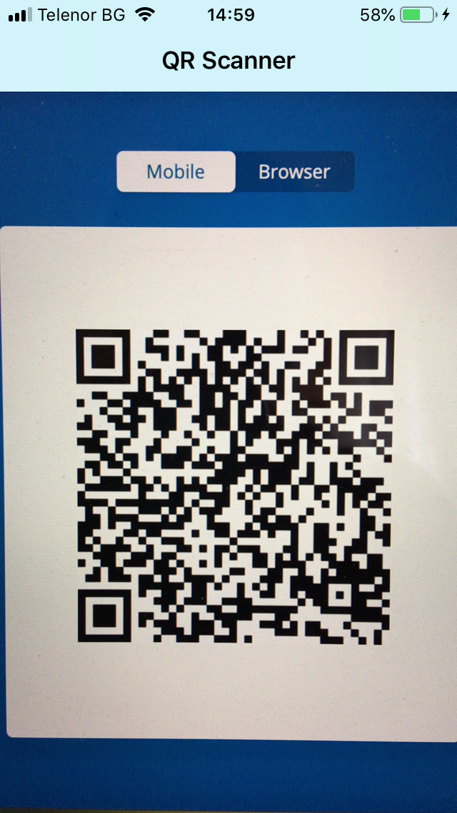
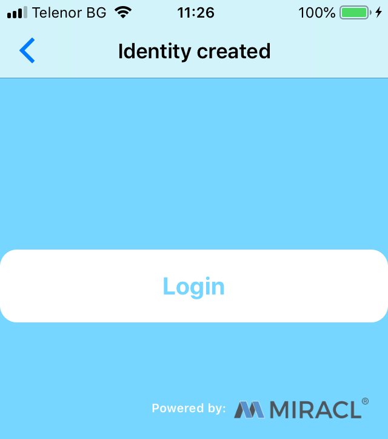

# Website Login Sample

* **category**: Samples
* **copyright**: 2019 MIRACL Technologies LTD
* **link**: https://github.com/miracl/sample-mobile-app-ios/tree/master/WebsiteLoginSample

## Description

This sample demonstrates how to use the [MIRACL iOS SDK](https://github.com/miracl/mfa-client-sdk-ios) in order to login into a MIRACL Trust-enabled website using [MIRACL MFA Platform](https://trust.miracl.cloud) authentication via an iOS device. This is the so-called **MFA Platform Login** flow and here is the methods sequence you need to achieve it:


## Requirements

* iOS 12 or higher
* Cocoapods

## Setup

1. Checkout the sample project from : https://github.com/miracl/sample-mobile-app-ios.git
>> git clone https://github.com/miracl/sample-mobile-app-ios.git
2. [Run a demo web app](#create-a-demo-web-app-to-log-into)
3. [Configure the app with the issued credentials](#configure-the-app-with-the-issued-credentials)
4. Build the project:
    1. From command line open the root dir from the checked out project. Navigate to folder WebsiteLoginSample.
    2. Execute the following command:
        >> pod install
    3. Open the .xcworkspace file which is located in the current directory.

## Create a demo web app to log into

In order to be able to test the demo iOS app, you need to run a backend service as a relying party demo web app (RPA). You could use one of our web SDKs as explained in the [SDK Instructions](https://devdocs.trust.miracl.cloud/sdk-instructions/) of our documentation.
The SDK authenticates to the [MIRACL Trust authentication portal](https://trust.miracl.cloud/), called also MFA, using [OpenIDConnect](https://openid.net/connect/) protocol. This means you need to login and create an application in it so you can take credentials (`client id` and `client secret`) for the communication. Note that the redirect URL set in this MFA web application needs to match your demo web application, concatenated with `/login` by default.


## Configure the app with the issued credentials

Before building an iOS app, you need to configure it through the [`Config.m`](WebsiteLogin/Config.m) file:

```
+ (NSString *)companyId
{
  return <# Replace with your company id from the platform #>;
}
+ (NSArray *)trustedDomains
{
  return @[@"miracl.net", @"mpin.io", <# Replace with backend ip/domain #>];
}
```

As the owner of the MFA web app, your `Company ID` is visible as a tooltip in the top right corner of your company dashboard in the MFA portal:


In the `trustedDomains` method, you need to add the URL of your demo RPA [configured here](#create-a-demo-web-app-to-log-into).

## MFA Platform Login implementation by MFA iOS SDK

### QRViewController

This is the first screen the user sees as a part of the demo. First, the `SDK` is initialized through [`[MPinMFA initSDK]`](https://github.com/miracl/mfa-client-sdk-ios#void-initsdk). Then the SDK needs to be setup with the Authentication Server by the Company ID (using [`[MPinMFA SetClientId:]`](https://github.com/miracl/mfa-client-sdk-ios#void-setclientid-nsstring-clientid)). For improved security [`[MPinMFA AddTrustedDomain:]`](https://github.com/miracl/mfa-client-sdk-ios#void-addtrusteddomain-nsstring--domain) is also called (note that this is an optional step):

```
[MPinMFA initSDK];
[MPinMFA SetClientId:[Config companyId]];
for (NSString *domain in [Config trustedDomains]) {
  [MPinMFA AddTrustedDomain: domain];
}
```

Note: Since most of the Miracl iOS SDK methods can be time-consuming operations, it is recommended to be called on background queue with `NSOperationQueue` or `Grand Central Dispatch`. You could see this pattern through the sample application.

When the app is first loaded and launched on your phone the QR reader will be displayed. Click on the `Login` button of your web browser app:


Then a QR code appears and you can scan it with your phone:



Once the information from the QR code has been read within `- (void)parseResponse:(NSString *)strResponse`, the access code, and the `base url` are obtained from the qr-read URL. This is followed by an `HTTP GET` request to the `/service` endpoint located at the `base url` to get the service details. Note that there is a SDK method [`[MPinMFA GetServiceDetails: serviceDetails:]`](https://github.com/miracl/mfa-client-sdk-ios#mpinstatus-getservicedetails-nsstring-url-servicedetails-servicedetails-sd) available which does the same thing and it should be used instead.
If there is an error in the returned response it will be displayed (considered errors are `HTTP Status codes` `412`, `406` or general JSON parsing errors). 

After the service details are obtained the SDK sets its authentication API URI by [`[MPinMFA SetBackend:]`](https://github.com/miracl/mfa-client-sdk-ios#mpinstatus-setbackend-const-nsstring-url) method using them:

```
MpinStatus *mpinStatus = [MPinMFA SetBackend:config[@"url"]];
```
The [`config`](#configure-the-app-with-the-issued-credentials) dictionary variable contains the service details data.

An optional step, not included in the demo is to make an SDK call to [`[MPinMFA GetSessionDetails:]`](https://github.com/miracl/mfa-client-sdk-ios#sessiondetails-getsessiondetails-nsstring-accesscode). This can be used to obtain the `preroll id` if needed.

If the value of `mpinStatus.status` is `OK`, then the next step is to check if any users are available. This is done in the `- (void)onSetBackendCompleted:(NSString *)accessCode` method. The list with available users is obtained via SDK call to [`[MPinMFA listUsers]`](https://github.com/miracl/mfa-client-sdk-ios#nsmutablearray-listusers):

```
NSArray* usersList = [MPinMFA listUsers];
```

If there are no saved users the user will be redirected to [RegisterViewController](#RegisterViewController) in order to create a new user. For simplicity of the sample app, it is designed to work with the first user from the list:

```
id<IUser> user = usersList[0];
```

Depending on the [`[user getState]`](https://github.com/miracl/mfa-client-sdk-ios#idiuser-makenewuser-const-nsstring-identity-devicename-const-nsstring-devname):
* If the user state is `REGISTERED`, continue with [authentication](#Identity-Authentication) of the user identity
* If the user state is `STARTED_REGISTRATION`, the user will be sent to [`RegisterViewController`](#RegisterViewController) in order to complete the registration
* Otherwise, an error message will be displayed.

#### Identity Authentication

When the user is in `REGISTERED` state, a call to [`[MPinMFA StartAuthentication: accessCode:]`](https://github.com/miracl/mfa-client-sdk-ios#mpinstatus-startauthentication-const-idiuser-user-accesscode-nsstring-accesscode) needs to be made. This sends the `user instance` and the `access code` to the MFA server in order to start the authentication process:

```
MpinStatus *mpinStatus = [MPinMFA StartAuthentication:user accessCode:accessCode];
```

If `mpinStatus.status` has value `OK` then the [`PinPadViewController`](#PinPadViewController) will be presented to the user to enter their `PIN` number so they can [finalize the authentication](#Finish-Identity-Authentication).

### RegisterViewController

The purpose of this view controller is to either create a new user registration or facilitate the completion of a started registration. First in the `- (void)viewWillAppear:(BOOL)animated` method [`[MPinMFA listUsers]`](https://github.com/miracl/mfa-client-sdk-ios#nsmutablearray-listusers) is called to check if any users are available. 

#### Identity Registration

If no users are available then the user will be shown a form to fill in their email in order to start a new registration:


Once the user enters their email and taps on the `Submit` button the `- (IBAction)onClickAddmButton:(id)sender` is called. First, the email will be validated and if validation fails an error message will be shown. Then the app will check if there already is a user with the desired email by making an SDK call to [`[MPinMFA getIUserById:]`](https://github.com/miracl/mfa-client-sdk-ios#idiuser-getiuserbyidnsstring--userid). If there is such user an error message will be shown.
If all validations pass then the app will try to create a new user (via SDK call to [`[MPinMFA MakeNewUser: deviceName:]`](https://github.com/miracl/mfa-client-sdk-ios#idiuser-makenewuser-const-nsstring-identity-devicename-const-nsstring-devname)) and start a new registration (via SDK call to [`[MPinMFA StartRegistration: accessCode: pmi:]`](https://github.com/miracl/mfa-client-sdk-ios#mpinstatus-startregistration-const-idiuser-user-accesscode-nsstring-accesscode-pmi-nsstring-pmi)):

```
self.user = [MPinMFA MakeNewUser:_txtAddUser.text deviceName:@"SampleDevName"];
MpinStatus *mpinStatus = [MPinMFA StartRegistration:self.user accessCode:self.accessCode pmi:@""];
```

Note that, for demonstration purposes, the `deviceName` variable is statically set here but it could be determined by user's requirements.

If `mpinStatus.status` has value `OK` this means the identity was created and the user will be presented with the following UI:


The message utilizes a call to the `[self.user  getIdentity]` [method](https://github.com/miracl/mfa-client-sdk-ios#idiuser-makenewuser-const-nsstring-identity-devicename-const-nsstring-devname) in order to display the information. 
If the registration was started successfully, a confirmation message is sent to the user's email in order to verify their identity registration. After the email verification, they need to click the `Confirmed` button which will result in a call to the `- (IBAction)onClickConfirmButton:(id)sender` method. There the app will check if the email confirmation is successful by calling [`[MPinMFA ConfirmRegistration:]`](https://github.com/miracl/mfa-client-sdk-ios#mpinstatus-confirmregistration-const-idiuser-user):

```
MpinStatus *mpinStatus = [MPinMFA ConfirmRegistration:self.user];
```
If `mpinStatus.status` has value `OK` this means that the user confirmed their identity by following the link from the email they received. The next step is to present the [`PinPadViewController`](#PinPadViewController) where the user will be able to [finalize the registration](#Finish-Identity-Registration).

The user also has an option to tap on the `Resend e-mail` button in case they didn't receive an email. This will result in a call to the `- (IBAction)onClickResendButton:(id)sender` method. Getting a new email requires the current user to be deleted and a new registration to start with the same identity. The user is deleted with an SDK call to [`[MPinMFA DeleteUser:]`](https://github.com/miracl/mfa-client-sdk-ios#void-deleteuser-const-idiuser-user) followed by an SDK call to [`[MPinMFA MakeNewUser: deviceName:]`](https://github.com/miracl/mfa-client-sdk-ios#idiuser-makenewuser-const-nsstring-identity-devicename-const-nsstring-devname) to create a new user with the same identity. Finally, SDK call to [`[MPinMFA StartRegistration: accessCode: pmi:]`](https://github.com/miracl/mfa-client-sdk-ios#mpinstatus-startregistration-const-idiuser-user-accesscode-nsstring-accesscode-pmi-nsstring-pmi) is made to start the new registration which will result in a new email being sent:

```
NSString *strUserID = [self.user getIdentity];
[MPinMFA DeleteUser:self.user];
self.user = [MPinMFA MakeNewUser:strUserID deviceName:@"SampleDevName"];
MpinStatus *mpinStatus = [MPinMFA StartRegistration:self.user accessCode:self.accessCode pmi:@""];
```

If `mpinStatus.status` has value `OK` this means that the registration was started successfully and the user can check their email.

### PinPadViewController

The purpose of the view controller is to present UI to the user where they can enter their `PIN` number and then handle it. First, the user is presented with an input field where they need to enter their 4-digit `PIN` number:


Once the user taps on the `Send` button `- (IBAction)onClickSendButton:(id)sender` will be called to handle the `PIN`. The next step is determined from the value of `[self.user getState]`.

#### Finish Identity Registration

If `[self.user getState]` has a value `STARTED_REGISTRATION` the user has started and confirmed their identity registration. They need to finalize it by calling [`[MPinMFA FinishRegistration: pin0: pin1:]`](https://github.com/miracl/mfa-client-sdk-ios#mpinstatus-finishregistration-const-idiuser-user-pin0-nsstring-pin0-pin1-nsstring-pin1) and pass as parameters the current `user instance` and the desired `PIN` number:

```
MpinStatus *mpinStatus = [MPinMFA FinishRegistration:self.user pin0:_txtPinPad.text pin1:nil];
```

If the value of `mpinStatus.status` is `OK` then [`SuccessfulViewController`](#SuccessfulViewController) will be presented to inform the user that the registration was completed.

#### Finish Identity Authentication

If `[self.user getState]` has a value `REGISTERED` this means that the user is trying to authenticate. To finish the authentication the [`[MPinMFA FinishAuthentication: pin: pin1:]`](https://github.com/miracl/mfa-client-sdk-ios#mpinstatus-finishauthentication-const-idiuser-user-pin-nsstring-pin-pin1-nsstring-pin1-accesscode-nsstring-accesscode-authzcode-nsstring-authzcode) method is called:

```
MpinStatus *mpinStatus = [MPinMFA FinishAuthentication:self.user pin0:_txtPinPad.text pin1:nil accessCode:qvc.accessCode];
```

If `mpinStatus.status` has value different than `OK` then an error message will be displayed.
If `mpinStatus.status` has value `OK` this means the user is authenticated successfully and [`LoginSuccessfulViewController`](#LoginSuccessfulViewController) is displayed.

### SuccessfulViewController

This view controller is presented to the user when the registration finishes.
Once the user taps the `Login` button they will be presented with the [`PinPadViewController`](#PinPadViewController)



### LoginSuccessfulViewController

This view controller is shown to the user just to inform them that authentication passed successfully and they are now logged in to the desired website and can go back to their browser and check:


## See also

1. [MobileAppLogin](https://github.com/miracl/sample-mobile-app-ios/tree/master/MobileAppLoginSample)
2. [DVSSample](https://github.com/miracl/sample-mobile-app-ios/tree/master/DVSSample)
3. [BootstrapSample](https://github.com/miracl/sample-mobile-app-ios/tree/master/BootstrapSample)